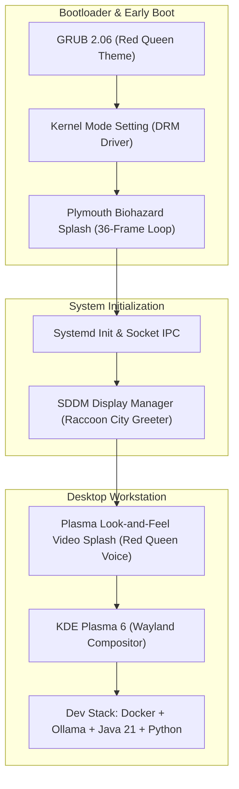

# Viva Voce Defense & Academic Systems Examination Skill

This skill prepares candidates to defend the Umbrella OS systems engineering project with 100% technical rigor, authority, and clarity before university examination panels and external evaluators.

---

## 1. Core Architectural Defense Talking Points

When examiners ask *"What makes Umbrella OS an engineering project rather than just a re-skinned Linux?"*, deliver these 4 pillars:

### 1.1 Custom System Layering & Integration Engine
* **Declarative Archiso Pipeline:** Deterministic compilation from upstream binary repositories, producing an immutable live squashfs image (`airootfs.sfs`).
* **Hardware-Accelerated KMS Display Pipeline:** Custom 36-frame early-boot Plymouth engine synchronized via systemd UNIX IPC sockets to eliminate display flicker.
* **10-Layer Unified Theme Architecture:** Complete chromatic consistency across GRUB, Plymouth, SDDM, Plasma Shell, KWin Blur Compositor, GTK 3, GTK 4, Konsole, and Cursor subsystems.

### 1.2 Zero-Config Developer & Local AI Runtime
* Native integration of **Ollama Local AI Engine** running on port `11434` with pre-configured developer tooling (Java 21 LTS, Python 3.12 ML stack, Docker CE, Fastfetch HUD).
* Automated `/etc/skel` provisioning engine that initializes user configs at runtime without hardcoded home paths.

---

## 2. Anticipated Examiner Questions & Strategic Responses

### Q1: *"Why Arch Linux and Archiso instead of Ubuntu or Debian (live-build)?"*
* **Response:**
  > *"Arch Linux provides a minimalist, rolling-release foundation with the pacman package manager. Unlike Debian or Ubuntu where pre-bundled packages introduce bloat and systemd unit bloat, Archiso allows declarative, package-by-package specification in `packages.x86_64`. This gave us total control over memory footprint (under 1.2 GB idle) and boot determinism."*

### Q2: *"How did you ensure that GTK applications respect your KDE dark theme?"*
* **Response:**
  > *"We addressed cross-toolkit fragmentation by configuring `gtk-3.0/settings.ini` and `gtk-4.0/settings.ini` inside `/etc/skel/.config/`, explicitly binding `gtk-theme-name=Breeze-Dark`, `gtk-icon-theme-name=Papirus-Dark`, and `gtk-application-prefer-dark-theme=1`. This eliminates white flash and visual mismatch in non-Qt applications like VS Code, Firefox, and GIMP."*

### Q3: *"How does Plymouth synchronize its progress bar with the kernel boot process?"*
* **Response:**
  > *"Plymouth does not rely on a fake timer. In `umbrella-plymouth.script`, `Plymouth.SetBootProgressFunction()` hooks into Systemd's internal progress notifications sent via `/run/plymouth/pid` UNIX socket. Furthermore, `plymouth quit --retain-splash` holds the last rendered frame until SDDM's DRM/KMS compositor takes over the display buffer, resulting in a zero-flicker transition."*

---

## 3. Systems Architecture Mermaid Diagram for Presentations

---

## 4. Live Viva Demonstration Protocol

1. **Demonstrate Boot Sequence:** Launch `./scripts/run-qemu.sh uefi` and explain the GRUB ➔ Plymouth ➔ SDDM ➔ Splash ➔ Desktop flow.
2. **Demonstrate Fastfetch Telemetry:** Open Konsole and show hardware telemetry with fastfetch and Red Queen ASCII emblem.
3. **Demonstrate Local AI:** Run `curl http://localhost:11434/api/tags` to prove Ollama background service initialization.
4. **Demonstrate Isolated Theme Previews:** Run `./scripts/preview-plymouth.sh` and `./scripts/preview-login.sh`.
