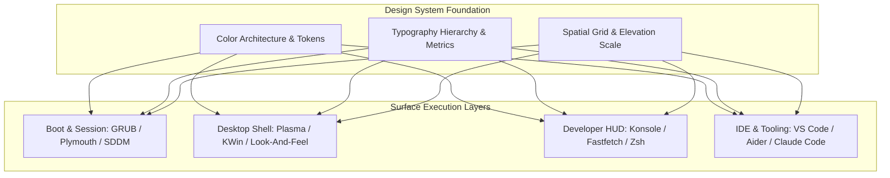
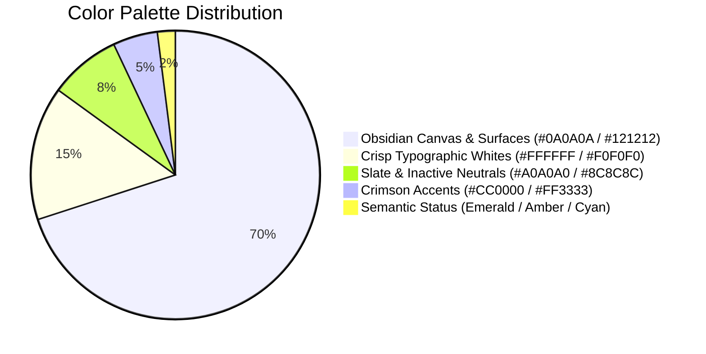
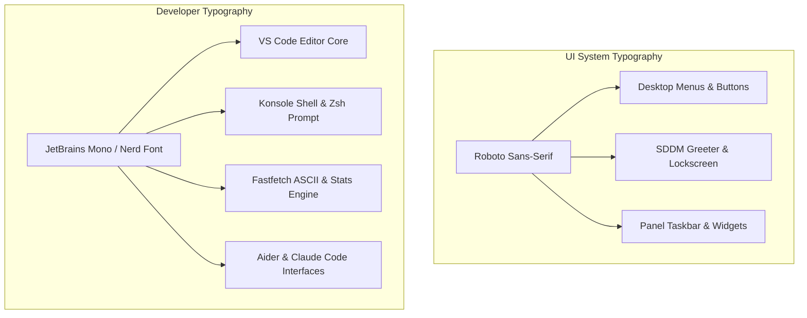
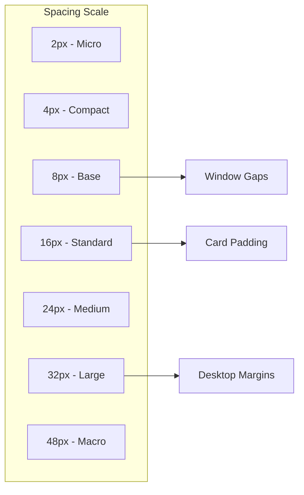
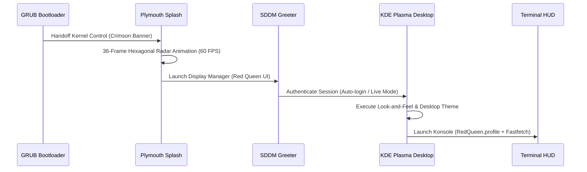
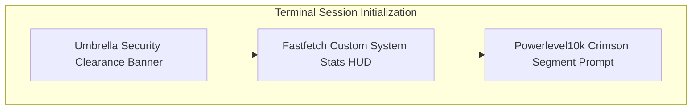

# Design System Specification: Umbrella OS (Red Queen Architecture)

| Document Property | Specification Details |
| :--- | :--- |
| **Project Name** | Umbrella OS (Custom Arch-Based Developer & AI Workstation) |
| **Document Type** | Comprehensive Design System & Human Interface Guidelines (A to Z) |
| **Design Codename** | Red Queen Dark Interface Architecture |
| **Target Platforms** | Linux x86_64 (KDE Plasma 6, SDDM, Plymouth, KWin, Konsole, VS Code) |
| **Color Model** | sRGB / Rec. 709 (High-Contrast Dark Bio-Cybernetic Spectrum) |
| **Typography Engine** | Roboto Sans (UI) / JetBrains Mono (Code & Terminal) |
| **Compliance Level** | WCAG 2.1 Level AA / AAA for Core Text Interfaces |
| **Document Version** | 1.0.0-RELEASE |

---

## 1. Executive Design Overview and Philosophy

Umbrella OS is an engineered developer operating system that bridges clinical bio-informatics, corporate cybernetics, and modern developer ergonomics. The visual and interactive identity is inspired by the fictional Umbrella Corporation and its governing artificial intelligence, the Red Queen. 

The design architecture departs from generic desktop environments by establishing an uncompromising, high-contrast dark environment optimized for deep work, software compilation, artificial intelligence orchestration, and systems engineering.

### 1.1 Core Design Pillars

The design system is structured around four foundational tenets:

1. **Absolute Contrast and Visual Ergonomics:** The human eye experiences significant fatigue during prolonged coding sessions in low-contrast or inconsistent lighting environments. Umbrella OS implements deep obsidian backgrounds paired with crisp white foregrounds and targeted crimson accents to maximize glyph legibility and minimize cognitive strain.
2. **Deterministic Functional Color Assignment:** Colors are never used for arbitrary decoration. Every hue carries a strict semantic meaning across all layers of the operating system, from the GRUB bootloader and systemd console to the KDE Plasma shell, Konsole terminal, and Visual Studio Code editor.
3. **Zero-Overhead Compositing:** Visual depth is achieved through controlled multi-pass Gaussian blur, subtle translucency (88 percent opacity on primary working surfaces), and crisp single-pixel borders. Shadows and gradients are strictly constrained to avoid GPU overhead and visual clutter.
4. **Bio-Cybernetic Immersion:** The aesthetic seamlessly reflects the high-tech, clinical atmosphere of the Red Queen AI. System status overlays, boot sequences, terminal HUDs, and lock screens convey authoritative feedback while maintaining frictionless developer workflows.



---

## 2. Brand Identity and Emblem Architecture

The Umbrella Corporation visual identity centers on the iconic eight-segment octagonal umbrella emblem. The geometric precision of this mark dictates the angles, grids, and framing elements utilized across the operating system interface.

### 2.1 Emblem Geometry and Proportions

The primary emblem consists of an octagon divided into eight equal triangular sectors alternating symmetrically between Crimson Red and Pure White.

* **Primary Angle Division:** 45-degree radial segments radiating from a central mathematical origin point.
* **Aspect Ratio:** Strict 1:1 square bounding box for all iconographic representations.
* **Clear Space Rule:** The emblem requires a minimum clear space perimeter equal to 25 percent of its outer radius (0.25 x R) on all four sides. No text, secondary logos, or interface borders may intrude into this clearance zone.
* **Minimum Display Dimensions:**
  * Application Tray / Favicon: 16x16 pixels (simplified vector geometry).
  * Panel Taskbar / Menu Launcher: 24x24 to 32x32 pixels.
  * System Dialogs / HUD Overlays: 64x64 to 128x128 pixels.
  * Plymouth Boot / SDDM Greeter / Lock Screen: 128x128 to 256x256 pixels.
  * Wallpaper Renderings / Hero Graphics: 3840x2160 pixels (4K UHD native raster).

### 2.2 Brand Emblem Usage Standards

* **Permitted Variants:**
  * Full Color: Alternating Crimson Red (`#CC0000`) and White (`#FFFFFF`) on dark surfaces.
  * Monochromatic White: Flat `#F0F0F0` for low-intensity system tray states.
  * Crimson Monolith: Solid `#CC0000` silhouette for security alert dialogs.
* **Prohibited Modifications:**
  * Do not rotate the emblem off its canonical 45-degree axis.
  * Do not apply non-system color gradients across the emblem sectors.
  * Do not skew, stretch, or alter the 1:1 proportional aspect ratio.
  * Do not place the emblem on low-contrast bright gray or saturated backgrounds without a dark backing plate.

---

## 3. Color System and Design Tokens

The color palette is engineered specifically for deep-space dark themes. It relies on a multi-tiered hierarchy: the **Crimson Accent Spectrum**, the **Obsidian Canvas Spectrum**, the **Monochromatic Typographic Spectrum**, and the **Semantic Status Spectrum**.



### 3.1 Primary Crimson Accent Spectrum

The crimson palette provides instant visual focus, identifies active interactive states, and establishes the authoritative Red Queen aesthetic.

| Token Name | Hex Code | RGB Values | Usage and Component Scope |
| :--- | :--- | :--- | :--- |
| `color-crimson-primary` | `#CC0000` | `rgb(204, 0, 0)` | Primary brand color, default button borders, text selections, focused input rings, primary active icons. |
| `color-crimson-hover` | `#E60000` | `rgb(230, 0, 0)` | Interactive hover state on buttons, active window close buttons, alert banner highlights. |
| `color-crimson-active` | `#FF3333` | `rgb(255, 51, 51)` | Active window titlebar text, terminal intense red, high-priority system alerts. |
| `color-crimson-tint` | `#1A0000` | `rgb(26, 0, 0)` | Active window titlebar background, highlighted list item surface tint. |
| `color-crimson-subtle` | `#0F0000` | `rgb(15, 0, 0)` | Alternate header background, deep gradient stops for lock screens. |

### 3.2 Obsidian and Dark Canvas Spectrum

The background palette uses calibrated neutral blacks and deep grays to establish structural depth without introducing color banding or blue-light fatigue.

| Token Name | Hex Code | RGB Values | Usage and Component Scope |
| :--- | :--- | :--- | :--- |
| `color-surface-void` | `#0A0A0A` | `rgb(10, 10, 10)` | Root desktop canvas, SDDM base background, Plymouth splash background, tooltip base. |
| `color-surface-base` | `#0D0D0D` | `rgb(13, 13, 13)` | Inactive window titlebars, window canvas backgrounds, file manager viewports. |
| `color-surface-elevated` | `#121212` | `rgb(18, 18, 18)` | Standard button background, taskbar panel surface, card containers, dialog backgrounds. |
| `color-surface-alternate`| `#141414` | `rgb(20, 20, 20)` | Alternate button fill, table row striping, dropdown menu surfaces. |
| `color-surface-intense`  | `#191919` | `rgb(25, 25, 25)` | Terminal intense background tile, hover states on table rows. |
| `color-surface-border`   | `#282828` | `rgb(40, 40, 40)` | Subtle component dividing rules, inactive window outlines, card borders. |

### 3.3 Monochromatic Typography and Data Hierarchy

Text colors are carefully calibrated to ensure WCAG AAA compliance across all background elevations.

| Token Name | Hex Code | RGB Values | Usage and Component Scope |
| :--- | :--- | :--- | :--- |
| `color-text-hero` | `#FFFFFF` | `rgb(255, 255, 255)` | Active window titles, selected text foreground, Fastfetch values, hero headings. |
| `color-text-primary` | `#F0F0F0` | `rgb(240, 240, 240)` | Standard application text, menu items, button labels, SDDM inputs, body paragraphs. |
| `color-text-secondary` | `#E6E6E6` | `rgb(230, 230, 230)` | Terminal default foreground, code editor standard text, system info sub-items. |
| `color-text-muted` | `#A0A0A0` | `rgb(160, 160, 160)` | Inactive window titles, secondary subtitles, placeholder labels, terminal faint text. |
| `color-text-disabled` | `#8C8C8C` | `rgb(140, 140, 140)` | Disabled buttons, inactive checkboxes, non-selectable system metadata. |
| `color-text-subtle` | `#646464` | `rgb(100, 100, 100)` | Inactive blend accents, code comments, structural ASCII art boundaries. |

### 3.4 Semantic Status Spectrum

Functional status colors provide universal visual clarity for code execution, compilation states, and operating system diagnostics.

| Semantic Purpose | Token Name | Hex Code | RGB Values | Usage Context |
| :--- | :--- | :--- | :--- | :--- |
| **Success / Clean** | `color-status-success` | `#00C850` | `rgb(0, 200, 80)` | Clean Git working tree, active daemon status, successful build execution. |
| **Success Highlight** | `color-status-success-intense`| `#64FF96` | `rgb(100, 255, 150)` | Selected text in positive state, terminal intense green. |
| **Warning / Pending** | `color-status-warning` | `#FFA500` | `rgb(255, 165, 0)` | Modified Git files, system warnings, pending updates, amber indicators. |
| **Warning Highlight** | `color-status-warning-intense`| `#FFDC64` | `rgb(255, 220, 100)` | Selected text in warning state, terminal intense yellow. |
| **Error / Critical** | `color-status-error` | `#E60000` | `rgb(230, 0, 0)` | Failed builds, runtime exceptions, stopped services, destructive actions. |
| **Info / Directory** | `color-status-info` | `#3264C8` | `rgb(50, 100, 200)` | Directory listings, standard hyperlinks, informational notices. |
| **Info Highlight** | `color-status-info-intense` | `#508CFF` | `rgb(80, 140, 255)` | Terminal intense blue, active link hovers. |
| **Special / Constant** | `color-status-magenta` | `#AA00AA` | `rgb(170, 0, 170)` | Constants, regex delimiters, visited hyperlinks. |
| **String / Identifier**| `color-status-cyan` | `#00B4B4` | `rgb(0, 180, 180)` | String literals, identifiers, file system paths. |

### 3.5 KDE Plasma System Palette Mapping (`RedQueen.colors`)

The system theme directly binds the design tokens to KDE Plasma color roles:

```ini
[Colors:Window]
BackgroundNormal=10,10,10
BackgroundAlternate=15,15,15
ForegroundNormal=240,240,240
ForegroundInactive=140,140,140
ForegroundActive=255,51,51
ForegroundLink=204,0,0
ForegroundNegative=230,0,0
ForegroundNeutral=255,165,0
ForegroundPositive=0,200,80
DecorationFocus=204,0,0
DecorationHover=230,0,0

[Colors:Header]
BackgroundNormal=26,0,0
BackgroundAlternate=15,0,0
ForegroundNormal=240,240,240
ForegroundActive=255,51,51
ForegroundInactive=160,160,160

[Colors:Selection]
BackgroundNormal=204,0,0
BackgroundAlternate=180,0,0
ForegroundNormal=255,255,255
ForegroundActive=255,255,255

[Colors:Button]
BackgroundNormal=18,18,18
BackgroundAlternate=20,20,20
ForegroundNormal=240,240,240
ForegroundActive=255,51,51
DecorationFocus=204,0,0
DecorationHover=230,0,0
```

### 3.6 Konsole 16-Color ANSI Terminal Matrix

The developer terminal environment binds the system color tokens to the standard 16 ANSI slots in `RedQueen.colorscheme`:

| ANSI Code | Name | Normal Hex | RGB Value | Intense Hex | RGB Value |
| :--- | :--- | :--- | :--- | :--- | :--- |
| **Color 0** | Black | `#121212` | `18, 18, 18` | `#282828` | `40, 40, 40` |
| **Color 1** | Red | `#CC0000` | `204, 0, 0` | `#FF3232` | `255, 50, 50` |
| **Color 2** | Green | `#50C850` | `80, 200, 80` | `#64FF64` | `100, 255, 100` |
| **Color 3** | Yellow | `#C8A000` | `200, 160, 0` | `#FFC800` | `255, 200, 0` |
| **Color 4** | Blue | `#3264C8` | `50, 100, 200` | `#508CFF` | `80, 140, 255` |
| **Color 5** | Magenta | `#AA00AA` | `170, 0, 170` | `#DC32DC` | `220, 50, 220` |
| **Color 6** | Cyan | `#00B4B4` | `0, 180, 180` | `#00DCDC` | `0, 220, 220` |
| **Color 7** | White | `#C8C8C8` | `200, 200, 200`| `#FFFFFF` | `255, 255, 255` |

---

## 4. Typography System and Typographic Hierarchy

The typography architecture uses a dual-font structure: **Roboto** for graphical user interface controls and **JetBrains Mono** for all code, shell, and data-dense interfaces.



### 4.1 Typeface Profiles

#### Primary Interface Typeface: Roboto
* **Classification:** Neo-Grotesque Geometric Sans-serif.
* **Characteristics:** Open aperture, tall x-height, neutral geometric construction, high legibility on high-DPI displays.
* **Target Usages:** Application windows, desktop panels, SDDM greeter text, dialog notifications, context menus.
* **Weights Utilized:** Regular (400), Medium (500), Bold (700).

#### Primary Monospace and Code Typeface: JetBrains Mono / JetBrainsMono Nerd Font
* **Classification:** Monospaced Code Typeface with Developer Ligatures.
* **Characteristics:** Increased lowercase height, distinct oval counters, clear disambiguation of `0`, `O`, `l`, `1`, `I`, full programming ligatures (`->`, `!=`, `===`, `=>`), pre-patched with Powerlevel10k and Nerd Font glyphs.
* **Target Usages:** Konsole terminal emulator, Visual Studio Code editor and integrated terminal, Fastfetch ASCII banners, Aider CLI, systemd boot logs.
* **Weights Utilized:** Regular (400), Medium (500), Bold (700).

### 4.2 Typographic Scale and Specification Matrix

| Scale Token | Typeface Family | Size (pt / px) | Weight | Line Height | Tracking (Letter Spacing) | Intended Scope and Context |
| :--- | :--- | :--- | :--- | :--- | :--- | :--- |
| `type-display-hero` | JetBrains Mono | 24pt / 32px | Bold (700) | 1.2 (38px) | `+0.05em` | Fastfetch umbrella headers, lock screen clock, boot title. |
| `type-heading-1` | Roboto | 18pt / 24px | Bold (700) | 1.3 (31px) | `+0.02em` | SDDM user greeting, splash screen title, modal dialog headers. |
| `type-heading-2` | Roboto | 14pt / 18px | SemiBold (600)| 1.4 (25px) | `+0.01em` | Window titlebars, card section headings, settings category titles. |
| `type-heading-3` | Roboto | 12pt / 16px | Medium (500) | 1.4 (22px) | Normal | Widget section headers, dialog subtitles, panel tooltips. |
| `type-body-regular` | Roboto | 10pt / 13px | Regular (400) | 1.5 (20px) | Normal | Standard UI labels, context menus, taskbar app names, body copy. |
| `type-body-small` | Roboto | 8pt / 11px | Regular (400) | 1.4 (15px) | Normal | Status bar indicators, system tray clock, micro footnotes. |
| `type-code-editor` | JetBrains Mono | 10.5pt / 14px | Regular (400) | 1.6 (22px) | Normal | VS Code core editing buffer, syntax token stream. |
| `type-code-terminal`| JetBrains Mono | 10pt / 13px | Regular (400) | 1.5 (20px) | Normal | Konsole shell viewport, Zsh Powerlevel10k prompt. |
| `type-code-hud` | JetBrains Mono | 8.5pt / 11px | Regular (400) | 1.3 (14px) | Normal | Fastfetch hardware metadata table, Aider token diffs. |

### 4.3 Typographic Rules and Technical Constraints

* **Ligature Policy:** Programming ligatures are strictly enabled in Visual Studio Code (`"editor.fontLigatures": true`) and terminal coding utilities. For pure shell commands and log parsing, standard distinct character spacing is preserved.
* **Numeric Figures:** All numbers displayed in tables, clocks, and data HUDs use tabular lining figures to ensure precise vertical column alignment.
* **Uppercase Tracking:** When uppercase typography is used for tactical branding (e.g., `"UMBRELLA CORPORATION"` or `"INITIALIZING RED QUEEN CORE..."`), tracking is expanded to `+0.08em` to maintain visual clarity and aesthetic authority.

---

## 5. Spatial Grid, Layout Architecture, and Elevation

Umbrella OS enforces a strict 8-point geometric grid system. All interface containers, margins, paddings, dock dimensions, and window gaps align with mathematically consistent multiples of 4px and 8px.



### 5.1 Spacing Scale Tokens

| Token | Dimension | Intended Application |
| :--- | :--- | :--- |
| `spacing-2xs` | 2px | Hairline dividers, focus ring stroke width, border radius on tight tags. |
| `spacing-xs` | 4px | Internal button padding vertical, icon-to-text inline spacing, panel margin offset. |
| `spacing-sm` | 8px | Window gaps in tiling layout, standard widget margin, list item vertical padding. |
| `spacing-md` | 12px | Compact dialog margins, toolbar button padding, card interior compact spacing. |
| `spacing-lg` | 16px | Standard card interior padding, modal dialog margins, terminal canvas margin. |
| `spacing-xl` | 24px | Section separation in forms, SDDM card component spacing, launcher grid gaps. |
| `spacing-2xl`| 32px | Desktop boundary padding, splash screen vertical separation, lock screen offsets. |
| `spacing-3xl`| 48px | Hero header top margin, full-screen HUD container spacing. |
| `spacing-4xl`| 64px | SDDM center anchor vertical offsets, splash screen logo clearance. |

### 5.2 Elevation and Z-Index Stratification

Depth is expressed through surface brightness and edge illumination rather than heavy drop shadows, preserving an agile and technical appearance.

| Elevation Level | Z-Index Token | Surface Fill | Border / Stroke Definition | Shadow Definition | Scope of Components |
| :--- | :--- | :--- | :--- | :--- | :--- |
| **Level 0** | `z-canvas` | `#0A0A0A` | None | None | Root desktop wallpaper, SDDM canvas, splash viewport. |
| **Level 1** | `z-surface` | `#0D0D0D` | 1px solid `#282828` | None | Inactive windows, file manager workspace, text editor canvas. |
| **Level 2** | `z-active` | `#121212` | 1px solid `#CC0000` (focus) | `0 4px 12px rgba(0,0,0,0.6)` | Active focused window, code editor active tab. |
| **Level 3** | `z-panel` | `#121212` (88% alpha)| 1px solid `#282828` | `0 2px 8px rgba(0,0,0,0.5)` | KDE Plasma bottom panel, dock launcher, system tray. |
| **Level 4** | `z-menu` | `#141414` | 1px solid `#CC0000` | `0 8px 24px rgba(0,0,0,0.8)` | Application launcher popup, context menus, tooltips. |
| **Level 5** | `z-modal` | `#121212` | 2px solid `#CC0000` | `0 16px 48px rgba(0,0,0,0.9)`| Sudo authentication prompts, critical system dialogs. |
| **Level 6** | `z-overlay` | `#0A0A0A` (95% alpha)| None | None | Red Queen lock screen, SDDM session switcher. |

---

## 6. Window Manager and Compositing Architecture (KWin)

The KWin window manager is configured for high responsiveness and distraction-free developer efficiency.

### 6.1 Compositing Rules (`kwinrc`)

* **Dual-Pass Gaussian Blur:** Enabled across all translucent surfaces (`blurEnabled=true`) with an 8px radius. This ensures underlying desktop content is diffused into a silky background texture without interfering with foreground text readability.
* **Translucency Engine:** Enabled (`translucencyEnabled=true`) with an 88 percent opacity level on terminal windows and developer HUDs.
* **Contrast Adaptation:** Contrast filter enabled (`contrastEnabled=true`) to dynamically deepen the dark values behind translucent windows.
* **Maximized Window Optimization:** `BorderlessMaximizedWindows=true` eliminates window titlebars when an application is maximized, allocating 100 percent of vertical screen estate to developer tooling.

### 6.2 Window Decoration Geometry

* **Corner Radius:** 4px subtle rounded corners for floating windows; 0px (sharp square) for tiled and maximized windows.
* **Active Titlebar:**
  * Background: `#1A0000` (deep crimson tint).
  * Foreground Title: `#FF3333` (bright red high-contrast text in Roboto SemiBold 10pt).
  * Focus Border: 1px continuous outline in `#CC0000`.
* **Inactive Titlebar:**
  * Background: `#0D0D0D` (neutral deep black).
  * Foreground Title: `#A0A0A0` (muted gray in Roboto Regular 10pt).
  * Inactive Border: 1px continuous outline in `#282828`.
* **Window Action Controls:**
  * Close Button: Circular glyph with hover transition to `#E60000` background.
  * Maximize Button: Minimal geometric square icon with hover transition to `#191919`.
  * Minimize Button: Horizontal bar icon with hover transition to `#191919`.

---

## 7. System Components and User Interface Surfaces

The design architecture spans the complete operating system lifecycle from the initial hardware bootloader to the active desktop session.



### 7.1 GRUB Bootloader Specification

* **Resolution Target:** 1920x1080 native raster background (`assets/grub/`).
* **Visual Atmosphere:** Atmospheric dark industrial graphic featuring the Umbrella Corporation insignia and security classification banner.
* **Menu Frame:** Centered navigation frame with a 1px border.
* **Selection Highlighting:** Active boot entries are highlighted with a solid Crimson Red bar (`#CC0000`) and pure white text (`#FFFFFF`), while inactive entries render in muted gray (`#A0A0A0`).

### 7.2 Plymouth Boot Splash (`umbrella-plymouth`)

* **Theme Structure:** Located in `/usr/share/plymouth/themes/umbrella-plymouth/`.
* **Background:** Absolute Black (`#000000`).
* **Animation Mechanism:** 36-frame circular hexagonal radar sequence (`spinner-0.png` through `spinner-35.png`) rendering a rotating tactical bio-radar element at 60 FPS.
* **Positioning:** Centered horizontally and vertically on the primary monitor.
* **Text Feedback:** Minimal systemd initialization messages rendered below the spinner in JetBrains Mono 10pt `#888888`.

### 7.3 SDDM Display Manager Greeter (`umbrella-sddm`)

* **Engine:** SDDM QML Plugin (`Main.qml` + `theme.conf`).
* **Background:** High-definition atmospheric research laboratory graphic (`images/background.jpg`).
* **Central Authentication Card:**
  * Geometry: 380px width, centered on screen.
  * Fill: `#0A0A0A` at 85 percent alpha with a 1px `#CC0000` border.
  * Logo: Centered 128x128px `umbrella-logo.png` above user prompt.
* **Input Fields (Username and Password):**
  * Background: `#121212` with 1px border (`#282828` inactive, `#CC0000` on focus).
  * Text Color: `#F0F0F0` in Roboto 11pt.
  * Placeholder Color: `#888888`.
* **Login Action Button:**
  * Background: `#CC0000` with hover transition to `#E60000`.
  * Text: `"ACCESS SESSION"` in Roboto Bold 10pt with `#FFFFFF` text.

### 7.4 KDE Plasma Desktop Shell (`org.umbrella.redqueen.desktop`)

* **Desktop Theme:** `RedQueen` desktop theme located in `/usr/share/plasma/desktoptheme/RedQueen/`.
* **Panel Configuration:**
  * Position: Bottom screen edge.
  * Height: 40px fixed.
  * Layout: Floating mode with a 4px edge margin.
  * Surface: `#121212` with 88 percent opacity and Gaussian blur.
  * App Launcher Icon: Custom Umbrella Corporation circular badge (`/usr/share/pixmaps/umbrella-logo.png`).
  * Taskbar Indicators: Active applications feature a bottom 2px crimson indicator bar (`#CC0000`); minimized applications display a muted slate indicator.
* **System Tray Hierarchy:**
  * Icons: Unified `Papirus-Dark` monochrome icons.
  * Network, Audio, Battery, and AI services grouped with 8px internal padding.
  * Clock Widget: Dual-row format displaying 24-hour time and ISO date (`YYYY-MM-DD`) in JetBrains Mono 9pt.

### 7.5 Red Queen Desktop Splash Screen (`Splash.qml`)

During KDE desktop session initialization, the system displays a four-stage tactical loading progression:

```qml
Text {
    text: "UMBRELLA CORPORATION"
    font.family: "JetBrains Mono"
    font.pixelSize: 18
    font.bold: true
    color: "#cc0000"
}
```

* **Stage 1:** `"INITIALIZING RED QUEEN CORE..."`
* **Stage 2:** `"LOADING NEURAL PROTOCOLS..."`
* **Stage 3:** `"ESTABLISHING SECURE ENVIRONMENT..."`
* **Stage 4:** `"RED QUEEN ACTIVE. ACCESS GRANTED."`

### 7.6 Unified Lock Screen (`LockScreenUi.qml`)

* **Aesthetic:** Minimalist security terminal.
* **Time Display:** Large digital clock in JetBrains Mono 48pt `#FFFFFF`.
* **Status Badge:** `"SECURITY LEVEL: RED QUEEN CLEARANCE REQUIRED"` in JetBrains Mono 10pt `#CC0000`.
* **Input Container:** Centered translucent card matching the SDDM design language.

---

## 8. Terminal and Developer Command-Line HUD

The terminal environment is the primary workplace for developers using Umbrella OS. It is styled to function as an integrated tactical heads-up display.



### 8.1 Konsole Profile (`RedQueen.profile`)

* **Profile Name:** `Red Queen` (default profile across all user sessions).
* **Color Scheme:** `RedQueen.colorscheme` with 88 percent surface opacity and 8px blur.
* **Font:** `JetBrains Mono` at 10pt with standard anti-aliasing.
* **Cursor Settings:** Block cursor with smooth blinking enabled (`#CC0000` fill).
* **Scrolling:** Hidden scrollbar for maximal horizontal workspace.

### 8.2 Fastfetch System Information HUD (`config.jsonc`)

Upon opening every interactive terminal session, `fastfetch` renders a structured two-column telemetry overview:

* **Left Column:** ASCII Umbrella Corporation insignia rendered in alternating ANSI Red (`#CC0000`) and White (`#FFFFFF`).
* **Right Column:** System diagnostics formatted with crimson keys and crisp white values:
  * **OS:** `Umbrella OS 1.0.0 (x86_64 Arch Linux)`
  * **Kernel:** `Linux 6.x LTS`
  * **Desktop:** `KDE Plasma 6 (Wayland/X11)`
  * **Shell:** `Zsh 5.9 + Powerlevel10k`
  * **Developer Stack:** `JDK 21 LTS, Python 3.12, Docker 27.x`
  * **AI Node:** `Ollama Local Inference Core`
  * **Memory / Disk:** Live utilization meters with color-coded warning thresholds.

### 8.3 Zsh and Powerlevel10k Prompt Specification (`.p10k.zsh`)

The shell prompt is structured into clear functional segments:

* **Directory Segment:** Deep crimson background (`#800000`) with bold white text (`#FFFFFF`) displaying the current working directory path.
* **Git Status Segment:**
  * Clean Repository: Dark emerald background (`#005020`) with white branch name.
  * Dirty / Modified Repository: Dark amber background (`#644000`) with modified file count badge.
* **Execution Time Segment:** Slate gray background (`#202020`) with duration in seconds for commands taking longer than 2.0 seconds.
* **Return Code Segment:** Renders a crimson badge (`#CC0000`) only when the preceding command returns a non-zero error exit code.

### 8.4 Message of the Day (MOTD)

The pre-login `/etc/motd` banner establishes the corporate operating environment:

```text
======================================================================
  UMBRELLA CORPORATION -- CLASSIFIED RESEARCH & DEVELOPMENT WORKSTATION
  SYSTEM AI: RED QUEEN (ACTIVE) -- CLEARANCE LEVEL: OMNI
  UNAUTHORIZED ACCESS WILL RESULT IN IMMEDIATE TERMINAL LOCKOUT
======================================================================
```

---

## 9. IDE and AI Tooling Design System

Software editors and artificial intelligence tools are harmonized with the global Red Queen design tokens.

### 9.1 Visual Studio Code Configuration (`settings.json`)

The default VS Code configuration located in `/etc/skel/.config/Code/User/settings.json` enforces the following styling rules:

```json
{
    "workbench.colorTheme": "One Dark Pro",
    "workbench.iconTheme": "material-icon-theme",
    "editor.fontFamily": "'JetBrains Mono', 'Fira Code', monospace",
    "editor.fontSize": 14,
    "editor.fontLigatures": true,
    "editor.lineHeight": 1.6,
    "editor.cursorBlinking": "smooth",
    "editor.cursorStyle": "block",
    "editor.renderWhitespace": "selection",
    "editor.formatOnSave": true,
    "terminal.integrated.fontFamily": "'JetBrainsMono Nerd Font'",
    "terminal.integrated.fontSize": 13,
    "workbench.startupEditor": "none",
    "git.autofetch": true,
    "editor.bracketPairColorization.enabled": true,
    "editor.guides.bracketPairs": "active"
}
```

* **Color Theme:** `One Dark Pro` with deep slate-black editor gutters and obsidian viewport background.
* **Typography:** `JetBrains Mono` at 14px with a 1.6 line height ratio for optimal vertical rhythm during extended reading.
* **Cursor Dynamics:** `smooth` blinking animation with a solid `block` cursor for exact terminal-style insertion feedback.
* **Bracket Pair Colorization:** Rainbow bracket matching with active depth guide lines to simplify complex AST navigation in nested Java and Python code.

### 9.2 AI Coding Terminals (Aider CLI and Claude Code)

* **Configuration:** `.config/aider/.aider.conf.yml` pre-configured for local Ollama endpoints.
* **Syntax Output:** Dark-mode optimized diff output where deletions are rendered in soft crimson (`#800000` backing, `#FF8080` text) and additions are rendered in soft forest emerald (`#005020` backing, `#80FF80` text).
* **Streaming Text Tokens:** Real-time token streaming rendered in crisp `#E6E6E6` with markdown tables formatted using clean ASCII dividers.

---

## 10. Iconography, Assets, and Media Guidelines

### 10.1 System Icon Theme

* **Primary Icon Theme:** `Papirus-Dark`.
* **Aesthetic Characteristics:** Crisp, flat vector glyphs with high-contrast outlines designed specifically for dark backgrounds.
* **Custom Icon Overrides:**
  * Launcher Icon: `/usr/share/pixmaps/umbrella-logo.png`
  * System Information Icon: Custom Red Queen circular emblem.
  * LiveCD Help and Installation Tools: High-contrast red and white utility badges.

### 10.2 Wallpaper and Background Media Specifications

All packaged wallpapers in `/usr/share/wallpapers/UmbrellaOS/` adhere to strict production criteria:

* **Resolution Standards:** Native 3840x2160 (4K UHD) with fallback 1920x1080 (FHD) downscaling.
* **Color Space:** sRGB 24-bit Truecolor.
* **Luminance Profile:** The central 60 percent of the wallpaper canvas must maintain a dark luminance profile (CIELAB L* <= 20) to ensure desktop icons and floating panels remain legible without visual conflict.
* **Curated Asset Index:**
  * `U_C OS1.jpg`: Tactical dark laboratory blueprint with crimson grid accents.
  * `U_C OS2.png`: Minimalist matte black surface with centered debossed Umbrella insignia.
  * `U_C OS3.jpg`: Red Queen holographic neural network array.
  * `285025.jpg` and `535703.jpg`: Atmospheric corporate facility aesthetic.

---

## 11. Motion, Dynamics, and Interaction Physics

Motion in Umbrella OS is purposeful, fast, and engineered to provide immediate tactile confirmation of user actions without artificial lag.

### 11.1 Standard Animation Timing Curves

| Curve Token | Cubic-Bezier Formula | Duration | Target Application |
| :--- | :--- | :--- | :--- |
| `motion-fast` | `cubic-bezier(0.2, 0.0, 0.2, 1.0)` | 100ms | Button hover states, checkbox toggles, menu item highlight transitions. |
| `motion-standard` | `cubic-bezier(0.25, 0.46, 0.45, 0.94)` | 200ms | Window minimize and restore animations, dropdown menu expansions. |
| `motion-deliberate` | `cubic-bezier(0.65, 0, 0.35, 1.0)` | 300ms | Virtual desktop workspace transitions, SDDM login card transitions. |
| `motion-continuous`| `linear` | 1000ms / cycle | Plymouth radar spinner rotation, background progress loaders. |

### 11.2 Micro-Interactions

* **Button Press State:** When triggered, buttons undergo a 1px inset scale shift with a border transition from `#282828` to `#CC0000`.
* **Focus Ring Transition:** Focused input controls smoothly expand a 1px crimson border ring over 120ms without layout shifting.
* **Window Snapping:** Windows snapping to screen quadrants display a translucent crimson highlight outline indicating the target dock boundary.

---

## 12. Accessibility, Usability, and Ergonomics

Umbrella OS enforces strict accessibility standards to ensure all technical data is readable and accessible to developers with diverse visual requirements.

### 12.1 WCAG 2.1 Compliance Matrix

| Interface Surface | Background Hex | Foreground Hex | Contrast Ratio | WCAG 2.1 Grade | Notes |
| :--- | :--- | :--- | :--- | :--- | :--- |
| **Standard Body Text** | `#0A0A0A` | `#F0F0F0` | **17.5 : 1** | AAA Pass | Far exceeds the 7.0:1 AAA standard for regular text. |
| **Terminal Code Buffer** | `#0A0000` | `#E6E6E6` | **16.1 : 1** | AAA Pass | High contrast, zero eye fatigue. |
| **Active Window Title** | `#1A0000` | `#FF3333` | **4.9 : 1** | AA Pass | Complies with the 4.5:1 AA requirement for UI headings. |
| **Selection Highlight** | `#CC0000` | `#FFFFFF` | **4.6 : 1** | AA Pass | Complies with the 4.5:1 requirement for large/bold text. |
| **Muted Metadata** | `#0A0A0A` | `#A0A0A0` | **8.2 : 1** | AAA Pass | High-contrast secondary text. |

### 12.2 Color Deficiency and Multi-Channel Feedback

* **Non-Reliance on Color Alone:** System statuses never rely exclusively on color hue. Every color indicator is paired with an unambiguous text label or distinct icon glyph (e.g., green status displays an explicit `"ACTIVE"` badge; red status displays an explicit `"ERROR"` or `"HALTED"` badge).
* **High-Contrast Terminal Palette:** The ANSI green, yellow, and red values in `RedQueen.colorscheme` have been shifted to ensure distinct luminance separation for users with deuteranopia and protanopia.

---

## 13. System Implementation File Mapping

The following table provides an exhaustive index connecting every design system token and component to its exact implementation file in the Umbrella OS repository:

| Design Layer / Component | Source Configuration File Path | Target Installed Path |
| :--- | :--- | :--- |
| **KDE Plasma Color Palette** | `archiso/airootfs/usr/share/color-schemes/RedQueen.colors` | `/usr/share/color-schemes/RedQueen.colors` |
| **Global Theme Defaults** | `archiso/airootfs/etc/skel/.config/kdeglobals` | `/etc/skel/.config/kdeglobals` |
| **KWin Compositor Rules** | `archiso/airootfs/etc/skel/.config/kwinrc` | `/etc/skel/.config/kwinrc` |
| **Plasma Theme Manifest** | `archiso/airootfs/etc/skel/.config/plasmarc` | `/etc/skel/.config/plasmarc` |
| **Plasma Theme Palette** | `archiso/airootfs/usr/share/plasma/desktoptheme/RedQueen/colors` | `/usr/share/plasma/desktoptheme/RedQueen/colors` |
| **Look-and-Feel Package** | `archiso/airootfs/usr/share/plasma/look-and-feel/org.umbrella.redqueen.desktop/` | `/usr/share/plasma/look-and-feel/org.umbrella.redqueen.desktop/` |
| **Desktop Splash Screen** | `.../look-and-feel/org.umbrella.redqueen.desktop/contents/splash/Splash.qml` | Same |
| **Desktop Lock Screen** | `.../look-and-feel/org.umbrella.redqueen.desktop/contents/lockscreen/LockScreenUi.qml` | Same |
| **Konsole Color Scheme** | `archiso/airootfs/etc/skel/.local/share/konsole/RedQueen.colorscheme` | `/etc/skel/.local/share/konsole/RedQueen.colorscheme` |
| **Konsole User Profile** | `archiso/airootfs/etc/skel/.local/share/konsole/RedQueen.profile` | `/etc/skel/.local/share/konsole/RedQueen.profile` |
| **Konsole Default Config** | `archiso/airootfs/etc/skel/.config/konsolerc` | `/etc/skel/.config/konsolerc` |
| **Fastfetch Telemetry Config**| `archiso/airootfs/etc/fastfetch/config.jsonc` | `/etc/fastfetch/config.jsonc` |
| **Fastfetch ASCII Art Logo** | `archiso/airootfs/etc/fastfetch/umbrella-logo.txt` | `/etc/fastfetch/umbrella-logo.txt` |
| **Zsh Shell Profile** | `archiso/airootfs/etc/skel/.zshrc` | `/etc/skel/.zshrc` |
| **Powerlevel10k Prompt** | `archiso/airootfs/etc/skel/.p10k.zsh` | `/etc/skel/.p10k.zsh` |
| **VS Code Preferences** | `archiso/airootfs/etc/skel/.config/Code/User/settings.json` | `/etc/skel/.config/Code/User/settings.json` |
| **Aider AI Preferences** | `archiso/airootfs/etc/skel/.config/aider/.aider.conf.yml` | `/etc/skel/.config/aider/.aider.conf.yml` |
| **SDDM Greeter Theme** | `archiso/airootfs/usr/share/sddm/themes/umbrella-sddm/theme.conf` | `/usr/share/sddm/themes/umbrella-sddm/theme.conf` |
| **SDDM QML Viewport** | `archiso/airootfs/usr/share/sddm/themes/umbrella-sddm/Main.qml` | `/usr/share/sddm/themes/umbrella-sddm/Main.qml` |
| **Plymouth Boot Splash** | `archiso/airootfs/usr/share/plymouth/themes/umbrella-plymouth/` | `/usr/share/plymouth/themes/umbrella-plymouth/` |
| **Desktop Wallpaper Set** | `archiso/airootfs/usr/share/wallpapers/UmbrellaOS/` | `/usr/share/wallpapers/UmbrellaOS/` |
| **GRUB Background Assets** | `assets/grub/` | `/boot/grub/themes/` |
| **System Branding Icon** | `archiso/airootfs/usr/share/pixmaps/umbrella-logo.png` | `/usr/share/pixmaps/umbrella-logo.png` |

---

## 14. Quality Assurance and Design Verification Checklist

To guarantee consistency during ISO compilation and live execution, every release candidate must pass this verification checklist:

1. **Boot Transition Cohesion:**
   - GRUB screen transitions seamlessly to Plymouth splash without monitor mode flicker or text artifacts.
   - Plymouth 36-frame spinner renders smoothly at 60 FPS across standard display refresh rates.
   - Plymouth hands off cleanly to the SDDM login card without screen tear.
2. **Desktop Interface Consistency:**
   - KDE Plasma launches with the `RedQueen` color scheme pre-selected in `kdeglobals`.
   - Window borders display `#CC0000` when focused and `#282828` when unfocused.
   - Bottom panel floats with 4px margin and 88 percent blur translucency.
   - Application menu launcher displays the custom Umbrella Corporation logo.
3. **Terminal and Shell Experience:**
   - Launching Konsole defaults to `RedQueen.profile` with `JetBrains Mono` 10pt.
   - Fastfetch displays the dual-column system telemetry and red/white ASCII logo.
   - Powerlevel10k prompt renders crimson directory badges and Git status segments without font rendering errors or missing glyphs.
4. **Developer Workstation Experience:**
   - Visual Studio Code launches with `One Dark Pro`, `JetBrains Mono` font ligatures, and smooth block cursor.
   - Aider CLI renders syntax-highlighted diffs matching the system green/crimson palette.
5. **Accessibility Verification:**
   - All text surfaces maintain a minimum 4.5:1 contrast ratio against their respective background elevations.
   - Colorblind users can distinguish Git states and terminal statuses via redundant textual and iconographic indicators.
