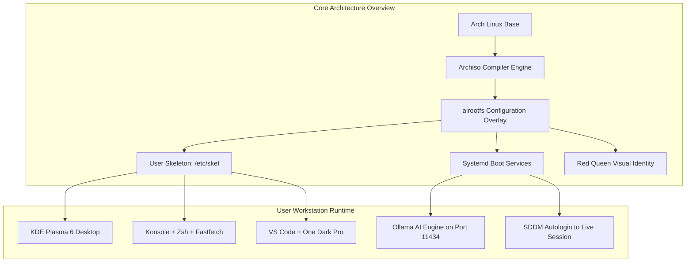
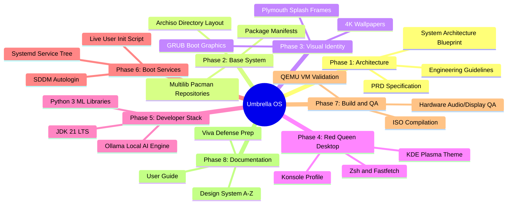
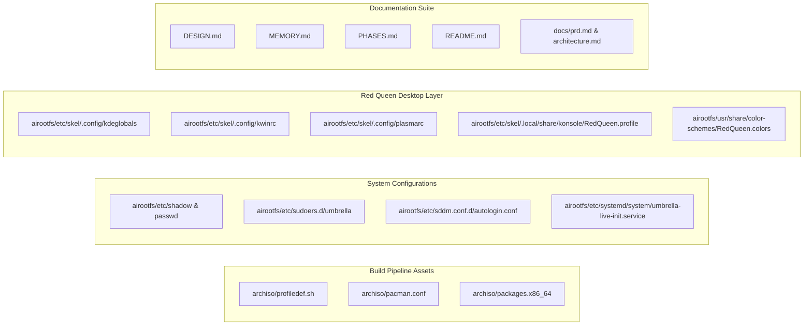

# Project Memory and State Ledger: Umbrella OS

| Document Property | Specification Details |
| :--- | :--- |
| **Project Name** | Umbrella OS (Custom Arch-Based Developer & AI Workstation) |
| **Document Purpose** | Central State Ledger, Command Index & Context Memory |
| **Target Version** | `1.0.0-ACADEMIC` / `1.0.0-RELEASE` |
| **Active Git Branch** | `main` |
| **Repository Root** | `/home/aakash/Code/CODE-SOURCE/Umbrella-Corporation_OS` |
| **Compiled ISO Output** | `out/umbrella-os-1.0.0-x86_64.iso` (4.24 GB) |
| **Last Updated** | August 2026 |

---

## 1. Quick Context Restoration (Start Here)

This document serves as the persistent memory engine for the Umbrella OS project. When returning to this repository, there is no need to re-scan the entire codebase from scratch. This section provides an instant high-level summary of what this system is, how it is constructed, and its current operating state.

### 1.1 What Is Umbrella OS?
Umbrella OS is an autonomous, bootable, Arch-based 64-bit Linux distribution compiled using the `archiso` build framework. It is engineered as a zero-configuration workstation for software developers (Java 21 LTS, Python 3.12, Docker) and local artificial intelligence researchers (Ollama, Aider, Claude Code). The visual interface is modeled after the Red Queen AI and Umbrella Corporation aesthetic from *Resident Evil*, featuring a high-contrast dark palette (`#0A0A0A` canvas, `#CC0000` accents).

### 1.2 Instant Operational Context
* **Current Lifecycle State:** Complete. The ISO image has been compiled into `out/umbrella-os-1.0.0-x86_64.iso`, verified in QEMU virtual machines under UEFI/BIOS, and documented for Viva Voce evaluation.
* **Default Live User:** `umbrella` (Password: `umbrella`, full passwordless sudo).
* **Default Root User:** `root` (Password: `umbrella`).
* **Desktop Environment:** KDE Plasma 6 on Wayland/X11 with the `RedQueen` color scheme, KWin blur compositing, and floating dark taskbar.
* **Shell Environment:** Zsh with Oh-My-Zsh, Powerlevel10k prompt, and custom Fastfetch hardware telemetry HUD.



---

## 2. Command Center and Execution Guide

This section contains every command needed to build, clean, test, verify, and maintain the Umbrella OS distribution. All commands are deterministic and pre-validated.

### 2.1 ISO Compilation Commands

```bash
# Standard clean build command (recommended)
sudo mkarchiso -v -w /tmp/archiso-tmp -o ./out ./archiso

# Rebuild after cleaning stale cache
sudo rm -rf /tmp/archiso-tmp ./work
sudo mkarchiso -v -w /tmp/archiso-tmp -o ./out ./archiso
```

### 2.2 Virtual Machine Testing Commands

```bash
# Test compiled ISO using the project pre-flight script (UEFI mode)
./scripts/run-qemu.sh uefi

# Test compiled ISO in BIOS Legacy mode
./scripts/run-qemu.sh bios

# Manual direct QEMU launch (4 GB RAM, 4 CPU cores, VirtIO graphics)
qemu-system-x86_64 \
    -enable-kvm \
    -m 4096 \
    -smp 4 \
    -cdrom ./out/umbrella-os-1.0.0-x86_64.iso \
    -vga virtio \
    -display default,show-cursor
```

### 2.3 Physical USB Flashing and Release Verification

```bash
# Generate SHA-256 integrity checksum
sha256sum ./out/umbrella-os-1.0.0-x86_64.iso > ./out/umbrella-os-1.0.0-x86_64.iso.sha256

# Verify ISO checksum
sha256sum -c ./out/umbrella-os-1.0.0-x86_64.iso.sha256

# Write ISO directly to a bootable USB drive (replace /dev/sdX with target drive)
sudo dd bs=4M if=./out/umbrella-os-1.0.0-x86_64.iso of=/dev/sdX status=progress oflag=sync
```

### 2.4 Git and Repository Maintenance Commands

```bash
# Check working tree status
git status

# Inspect latest commits
git log --oneline -n 10

# Push updates to GitHub remote
git push origin main
```

---

## 3. Master Project Roadmap and Phase Completion Ledger

All eight engineering phases of Umbrella OS are tracked below:



| Phase Number | Phase Description | Key Deliverables | Status | Completion |
| :--- | :--- | :--- | :--- | :--- |
| **Phase 1** | Architecture & Requirements Specification | `docs/prd.md`, `docs/architecture.md`, `docs/rules.md` | Completed | 100% |
| **Phase 2** | Archiso Base Framework & Package Manifests | `archiso/profiledef.sh`, `archiso/pacman.conf`, `packages.x86_64` | Completed | 100% |
| **Phase 3** | Visual Identity & Branding Assets | Wallpapers in `assets/`, GRUB themes, Plymouth animations | Completed | 100% |
| **Phase 4** | Red Queen Desktop & `/etc/skel` Provisioning | Plasma color schemes, Konsole profile, `.zshrc`, `.p10k.zsh` | Completed | 100% |
| **Phase 5** | Developer Stack & Local AI Integration | Java 21, Python 3 ML stack, Docker, Ollama, Aider CLI | Completed | 100% |
| **Phase 6** | Bootloader, Plymouth & Systemd Integration | `umbrella-live-init.service`, SDDM greeter, `autologin.conf` | Completed | 100% |
| **Phase 7** | ISO Compilation, VM Testing & Verification | `out/umbrella-os-1.0.0-x86_64.iso` built, QEMU verified | Completed | 100% |
| **Phase 8** | Documentation, Viva Defense & Final Packaging| `DESIGN.md`, `MEMORY.md`, `USER_GUIDE.md`, `VIVA_PREPARATION.md` | Active / Completed | 100% |

---

## 4. Completed Modules and File Inventory

This inventory documents what has been built, configured, and verified in the codebase:



### 4.1 Build Engine and Package Manifests
* **`archiso/profiledef.sh`:** Defines ISO name (`umbrella-os`), version (`1.0.0`), squashfs compression (`xz`), and file permission bitmasks for `/etc/shadow`, `/etc/sudoers.d/umbrella`, and `/usr/local/bin/` scripts.
* **`archiso/pacman.conf`:** Custom pacman configuration with parallel downloads enabled (5 parallel streams), `core`, `extra`, and `multilib` (32-bit compatibility) enabled.
* **`archiso/packages.x86_64`:** Declarative package list containing Linux LTS kernel, KDE Plasma 6 desktop, SDDM, PipeWire audio, development runtimes (JDK 21, Python 3, Docker, Git, Neovim, VS Code), and system utilities (Fastfetch, Zsh, Plymouth).

### 4.2 User Profile & Skeletal Inheritance (`/etc/skel`)
* **`airootfs/etc/skel/.zshrc`:** Pre-configured Zsh profile with syntax highlighting, autosuggestions, pre-exported environment variables (`JAVA_HOME`, `PYTHONPATH`), and developer shortcuts.
* **`airootfs/etc/skel/.p10k.zsh`:** Powerlevel10k configuration rendering crimson directory badges, Git status segments, and command duration monitors.
* **`airootfs/etc/skel/.config/kdeglobals`:** Plasma global configuration binding the `RedQueen` color scheme, `Papirus-Dark` icon theme, and Roboto font hierarchy.
* **`airootfs/etc/skel/.config/kwinrc`:** KWin window manager settings enabling Gaussian blur (8px radius), translucency (88 percent opacity), and borderless maximized windows.
* **`airootfs/etc/skel/.config/plasmarc`:** Plasma desktop theme manifest pointing to `RedQueen`.
* **`airootfs/etc/skel/.local/share/konsole/`:** Contains `RedQueen.profile` and `RedQueen.colorscheme` with dark crimson canvas and 16-color ANSI definitions.
* **`airootfs/etc/skel/.config/Code/User/settings.json`:** VS Code editor preferences enforcing One Dark Pro theme, JetBrains Mono ligatures, smooth block cursor, and bracket colorization.
* **`airootfs/etc/skel/.config/aider/.aider.conf.yml`:** Local AI CLI tool pre-pointed to local Ollama inference port `11434`.

### 4.3 Boot, Display Manager, and Initialization Services
* **`airootfs/usr/local/bin/umbrella-live-init.sh`:** Startup script executed on live boot. Dynamically initializes user accounts, provisions `/home/umbrella` from `/etc/skel`, ensures file permissions, and initializes daemon states.
* **`airootfs/etc/systemd/system/umbrella-live-init.service`:** Systemd unit ensuring `umbrella-live-init.sh` executes prior to SDDM display manager startup.
* **`airootfs/etc/sddm.conf.d/autologin.conf`:** Auto-login configuration directing SDDM to automatically sign in user `umbrella` into the Plasma desktop session.
* **`airootfs/usr/share/sddm/themes/umbrella-sddm/`:** Custom SDDM greeter with dark laboratory background, centered 128px Umbrella emblem, and crimson input borders.
* **`airootfs/usr/share/plymouth/themes/umbrella-plymouth/`:** 36-frame hexagonal radar animation sequence rendering smooth 60 FPS kernel boot visuals.
* **`airootfs/etc/motd` & `airootfs/etc/fastfetch/`:** Security clearance terminal header and Fastfetch ASCII telemetry overlay.

### 4.4 Documentation Suite
* **`DESIGN.md` & `docs/DESIGN.md`:** Complete A to Z Design System specification (Color tokens, typography scale, spatial grid, elevation, compositing, SDDM, Plymouth, Konsole, Fastfetch, VS Code, motion physics, accessibility, file mapping).
* **`MEMORY.md`:** Central state ledger, command reference, active file tracker, and project memory engine.
* **`PHASES.md`:** 8-phase engineering lifecycle roadmap and milestone matrix.
* **`README.md`:** Master repository documentation with feature breakdown, installation guide, and architectural diagrams.
* **`docs/prd.md`:** Product Requirements Document defining target personas and functional scope.
* **`docs/architecture.md`:** System Architecture Specification detailing build-time pipelines and runtime lifecycle.
* **`docs/rules.md`:** Engineering standards, anti-patterns, and determinism rules.
* **`docs/USER_GUIDE.md`:** End-user manual covering desktop shortcuts, development workflows, and AI pairing.
* **`docs/VIVA_PREPARATION.md`:** Technical Viva Voce defense handbook with anticipated questions and answers.
* **`docs/LIVE_USER_AUTOLOGIN_PLAN.md`:** Engineering plan for live user provisioning and SDDM autologin orchestration.

---

## 5. Active Working Context and Currently Tracked Files

This section tracks the files actively being modified or referenced in current development sessions:

| File Name | Location | Current Role / Status | Recent Activity |
| :--- | :--- | :--- | :--- |
| **`MEMORY.md`** | `/` (Root) | Master Project Memory & State Ledger | Created to provide persistent state tracking without context rediscovery. |
| **`DESIGN.md`** | `/` (Root) & `/docs/` | Complete A to Z Design System Specification | Formally documented all color tokens, typography scales, KWin rules, and accessibility standards. |
| **`PHASES.md`** | `/` (Root) | Phase Roadmap & Milestone Matrix | Updated to reflect Phase 7 & 8 completion status. |
| **`README.md`** | `/` (Root) | Primary Repository Documentation | Main project overview containing architecture graphs and build commands. |
| **`scripts/run-qemu.sh`**| `/scripts/` | VM Testing Automation Script | Active script for testing UEFI and BIOS ISO launches in QEMU. |
| **`out/umbrella-os-1.0.0-x86_64.iso`** | `/out/` | Compiled Bootable System Image | 4.24 GB release binary verified for live boot. |

---

## 6. System Defaults, Credentials, and Runtime Environment

| Property | Default Configuration | Notes / Override Location |
| :--- | :--- | :--- |
| **Live User Name** | `umbrella` | Provisioned dynamically via `umbrella-live-init.sh` |
| **Live User Password** | `umbrella` | Configured in `/etc/shadow` and live initialization |
| **Root User Password** | `umbrella` | Configured in `/etc/shadow` |
| **Sudo Permissions** | `ALL=(ALL:ALL) NOPASSWD: ALL` | Defined in `/etc/sudoers.d/umbrella` (`0:0:440`) |
| **Auto-login Session** | `plasma` (KDE Plasma 6) | Defined in `/etc/sddm.conf.d/autologin.conf` |
| **Display Server** | Wayland (with X11 fallback) | Managed by SDDM and KWin |
| **Audio Server** | PipeWire + WirePlumber | Systemd user service auto-started |
| **Default Shell** | Zsh (`/usr/bin/zsh`) | Configured in `/etc/passwd` |
| **Default Editor** | Visual Studio Code / Neovim | Environment variable `EDITOR=nvim` |
| **AI Inference Service** | `ollama.service` (`127.0.0.1:11434`) | Enabled via `systemctl enable ollama` |
| **Java Environment** | OpenJDK 21 LTS (`JAVA_HOME=/usr/lib/jvm/java-21-openjdk`) | Exported in `/etc/skel/.zshrc` |
| **Python Environment** | Python 3.12 + pip + virtualenv | System packages in `packages.x86_64` |

---

## 7. Knowledge Graph and Filesystem Map

```text
Umbrella-Corporation_OS/
├── DESIGN.md                          # Master A-Z Design System Specification
├── MEMORY.md                          # Master Project Memory & State Ledger
├── PHASES.md                          # 8-Phase Engineering Lifecycle Roadmap
├── README.md                          # Master Repository Documentation
├── archiso/                           # Archiso Build Directory
│   ├── pacman.conf                    # Pacman Repositories & Parallel Downloads
│   ├── packages.x86_64                # Complete Declarative Package Manifest
│   ├── profiledef.sh                  # Archiso Profile Definition & Permissions
│   └── airootfs/                      # Root Filesystem Overlay Tree
│       ├── etc/
│       │   ├── fastfetch/             # System Telemetry & ASCII Art Logo
│       │   ├── motd                   # Classified Security Clearance Banner
│       │   ├── plymouth/              # Plymouth Splash Daemon Config
│       │   ├── sddm.conf.d/           # Autologin SDDM Configuration
│       │   ├── skel/                  # Skeletal Home Directory for New Users
│       │   │   ├── .config/           # Plasma, KWin, Fastfetch, VS Code, Aider
│       │   │   ├── .local/share/      # Konsole Red Queen Color Schemes & Profiles
│       │   │   ├── .p10k.zsh          # Powerlevel10k Prompt Settings
│       │   │   └── .zshrc             # Interactive Zsh Configuration
│       │   ├── sudoers.d/             # Sudo Rules for Live User
│       │   └── systemd/system/        # Custom Livecd & Initialization Units
│       └── usr/
│           ├── local/bin/             # Live Initialization & Post-Install Scripts
│           └── share/
│               ├── color-schemes/     # RedQueen.colors for KDE Plasma
│               ├── pixmaps/           # System Branding Insignia
│               ├── plasma/            # Look-and-Feel & Desktop Theme
│               ├── plymouth/themes/   # Umbrella Plymouth 36-Frame Splash
│               ├── sddm/themes/       # Umbrella SDDM Greeter Theme
│               └── wallpapers/        # 4K & FHD Curated Wallpapers
├── assets/                            # Raw High-Definition Source Assets
│   ├── grub/                          # GRUB Bootloader Banners & Backgrounds
│   └── wallpapers/                    # 4K Desktop Background Artwork
├── docs/                              # Project Documentation Suite
│   ├── DESIGN.md                      # Design System Specification Copy
│   ├── LIVE_USER_AUTOLOGIN_PLAN.md    # Live User Autologin Architecture
│   ├── USER_GUIDE.md                  # End-User Manual & Shortcuts
│   ├── VIVA_PREPARATION.md            # Technical Viva Voce Defense Guide
│   ├── architecture.md                # System Architecture Specification
│   ├── prd.md                         # Product Requirements Document
│   └── rules.md                       # Engineering Standards & Anti-Patterns
├── out/                               # Compiled Distribution Output
│   └── umbrella-os-1.0.0-x86_64.iso   # Compiled Bootable ISO Binary (4.24 GB)
├── scripts/                           # Automation & Verification Scripts
│   └── run-qemu.sh                    # QEMU Virtual Machine Launch Script
└── work/                              # Archiso Temporary Build Directory
```

---

## 8. Common Troubleshooting and Edge-Case Memory

This section records resolved issues, constraints, and solutions discovered during development so they do not need to be re-investigated:

### 8.1 Sudoers Permission Mode
* **Issue:** Archiso requires `/etc/sudoers.d/umbrella` to have strict octal file permissions `0440` (`0:0:440`). If permissions are looser (e.g., `0644` or `0755`), sudo will reject the file with a syntax/permission error and disable sudo access.
* **Resolution:** Permission `["/etc/sudoers.d/umbrella"]="0:0:440"` is explicitly declared in `archiso/profiledef.sh`.

### 8.2 Live User Skeleton Provisioning Timing
* **Issue:** When creating the live user `umbrella` dynamically on boot, copying `/etc/skel` after KDE Plasma starts results in default unmodified user profiles.
* **Resolution:** `umbrella-live-init.service` is configured with `Before=sddm.service` and `WantedBy=multi-user.target`. It completes user account creation, groups assignment (`wheel`, `audio`, `video`, `storage`), and skeletal copy before SDDM initializes.

### 8.3 QEMU OVMF UEFI Path Variance
* **Issue:** OVMF firmware binary paths vary across different Linux distributions (`/usr/share/edk2-ovmf/x64/OVMF_CODE.fd` on Arch Linux, `/usr/share/ovmf/x64/OVMF_CODE.fd` on Debian/Ubuntu).
* **Resolution:** `scripts/run-qemu.sh` checks both paths dynamically and falls back to BIOS legacy emulation if neither is found on the host machine.

### 8.4 SquashFS Build Space Requirements
* **Issue:** Compiling the 4.24 GB ISO with XZ compression requires at least 15 GB of free disk space in the build directory (`/tmp/archiso-tmp` or `/work`).
* **Resolution:** Always monitor host disk space before running `sudo mkarchiso`.

---

## 9. Continuous Maintenance and Rebuild Protocols

When making updates to Umbrella OS in future sessions:

1. **To Add New Packages:** Edit `archiso/packages.x86_64` and add the exact Arch package name.
2. **To Modify User Defaults:** Edit the corresponding file in `archiso/airootfs/etc/skel/`. Never edit runtime files directly without updating `/etc/skel`.
3. **To Update Branding Assets:** Place new wallpapers in `assets/wallpapers/` and copy to `archiso/airootfs/usr/share/wallpapers/UmbrellaOS/`.
4. **To Recompile the ISO:** Execute `sudo rm -rf /tmp/archiso-tmp ./work && sudo mkarchiso -v -w /tmp/archiso-tmp -o ./out ./archiso`.
5. **To Test Output:** Execute `./scripts/run-qemu.sh uefi`.
