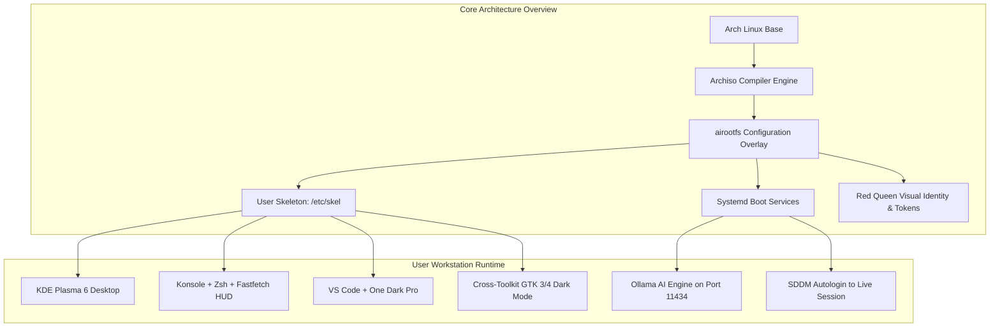
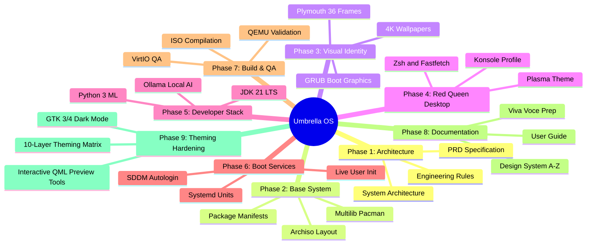
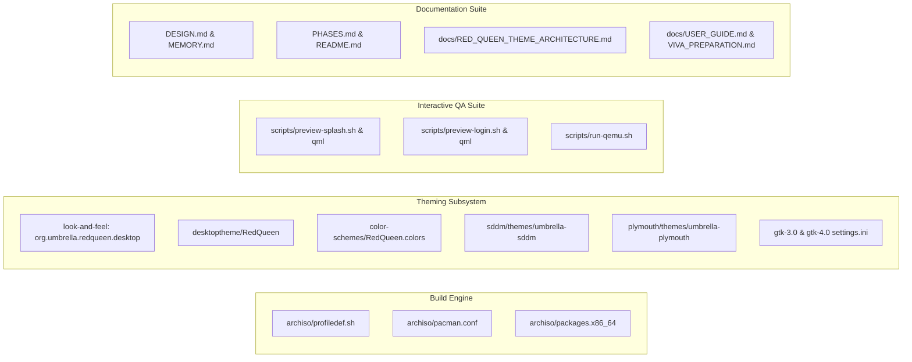

# Project Memory and State Ledger: Umbrella OS

| Document Property | Specification Details |
| :--- | :--- |
| **Project Name** | Umbrella OS (Custom Arch-Based Developer & AI Workstation) |
| **Document Purpose** | Central State Ledger, Command Index & Context Memory |
| **Target Version** | `1.0.0-ACADEMIC` / `1.0.0-RELEASE` |
| **Active Git Branch** | `main` |
| **Repository Root** | `/home/aakash/Code/CODE-SOURCE/Umbrella-Corporation_OS` |
| **Compiled ISO Output** | `out/umbrella-os-1.0.0-x86_64.iso` (4.0 GB) |
| **Last Updated** | August 2026 |

---

## 1. Quick Context Restoration (Start Here)

This document serves as the persistent memory engine for the Umbrella OS project. When returning to this repository, there is no need to re-scan the entire codebase from scratch. This section provides an instant high-level summary of what this system is, how it is constructed, and its current operating state.

### 1.1 What Is Umbrella OS?
Umbrella OS is an autonomous, bootable, Arch-based 64-bit Linux distribution compiled using the `archiso` build framework. It is engineered as a zero-configuration workstation for software developers (Java 21 LTS, Python 3.12, Docker) and local artificial intelligence researchers (Ollama, Aider, Claude Code, OpenCode). The visual interface is modeled after the Red Queen AI and Umbrella Corporation aesthetic from *Resident Evil*, featuring a high-contrast dark palette (`#0A0A0A` canvas, `#CC0000` accents).

### 1.2 Instant Operational Context
* **Current Lifecycle State:** Phase 9 Active / Hardened. Core ISO compiled (`out/umbrella-os-1.0.0-x86_64.iso` - 4.0 GB). Red Queen Full-Stack Theming and live interactive simulation tooling fully established.
* **Default Live User:** `umbrella` (Password: `umbrella`, full passwordless sudo).
* **Default Root User:** `root` (Password: `umbrella`).
* **Desktop Environment:** KDE Plasma 6 on Wayland/X11 with the `RedQueen` color scheme, KWin blur compositing, and floating dark taskbar.
* **Shell Environment:** Zsh with Oh-My-Zsh, Powerlevel10k prompt, and custom Fastfetch hardware telemetry HUD.
* **Theming Subsystem:** 10-layer visual engineering matrix covering GRUB, Plymouth (36-frame radar), SDDM, Look-and-Feel, Plasma style, Konsole, and GTK 3/4.



---

## 2. Command Center and Execution Guide

This section contains every command needed to build, clean, test, verify, and maintain the Umbrella OS distribution.

### 2.1 Live Interactive Theming & Simulation Tools

```bash
# 1. Launch Early Boot Plymouth Splash Preview (36-Frame Rotating Biohazard + Progress Bar)
./scripts/preview-plymouth.sh

# 2. Launch Interactive SDDM Security Terminal Login Screen Preview (Raccoon City Edition)
./scripts/preview-login.sh

# 3. Launch Post-Login Native QML Splash Screen Preview (Red Queen Staged Protocol Animation)
./scripts/preview-splash.sh
```

### 2.2 Virtual Machine Testing Commands

```bash
# Test compiled ISO using the project pre-flight script (UEFI mode)
./scripts/run-qemu.sh uefi

# Test compiled ISO in BIOS Legacy mode
./scripts/run-qemu.sh bios

# Direct manual QEMU launch with VirtIO graphics acceleration
qemu-system-x86_64 \
    -enable-kvm \
    -m 4096 \
    -smp 4 \
    -cdrom ./out/umbrella-os-1.0.0-x86_64.iso \
    -vga virtio \
    -display default,show-cursor
```

### 2.3 ISO Compilation Commands

```bash
# Clean stale cache and rebuild release ISO
sudo rm -rf /tmp/archiso-tmp ./work
sudo mkarchiso -v -w /tmp/archiso-tmp -o ./out ./archiso
```

### 2.4 Physical USB Flashing and Release Verification

```bash
# Generate SHA-256 integrity checksum
sha256sum ./out/umbrella-os-1.0.0-x86_64.iso > ./out/umbrella-os-1.0.0-x86_64.iso.sha256

# Verify ISO checksum
sha256sum -c ./out/umbrella-os-1.0.0-x86_64.iso.sha256

# Write ISO directly to a bootable USB drive (replace /dev/sdX with target drive)
sudo dd bs=4M if=./out/umbrella-os-1.0.0-x86_64.iso of=/dev/sdX status=progress oflag=sync
```

---

## 3. Master Project Roadmap & Milestone Ledger



| Phase Number | Phase Description | Key Deliverables | Status | Completion |
| :--- | :--- | :--- | :--- | :--- |
| **Phase 1** | Architecture & Requirements Specification | `docs/prd.md`, `docs/architecture.md`, `docs/rules.md` | Completed | 100% |
| **Phase 2** | Archiso Base Framework & Package Manifests | `archiso/profiledef.sh`, `archiso/pacman.conf`, `packages.x86_64` | Completed | 100% |
| **Phase 3** | Visual Identity & Branding Assets | Wallpapers in `assets/`, GRUB themes, Plymouth animations | Completed | 100% |
| **Phase 4** | Red Queen Desktop & `/etc/skel` Provisioning | Plasma color schemes, Konsole profile, `.zshrc`, `.p10k.zsh` | Completed | 100% |
| **Phase 5** | Developer Stack & Local AI Integration | Java 21, Python 3 ML stack, Docker, Ollama, Aider CLI | Completed | 100% |
| **Phase 6** | Bootloader, Plymouth & Systemd Integration | `umbrella-live-init.service`, SDDM greeter, `autologin.conf` | Completed | 100% |
| **Phase 7** | ISO Compilation, VM Testing & Verification | `out/umbrella-os-1.0.0-x86_64.iso` built (4.0 GB), QEMU verified | Completed | 100% |
| **Phase 8** | Documentation Suite & Master Memory Ledger | `DESIGN.md`, `MEMORY.md`, `USER_GUIDE.md`, `VIVA_PREPARATION.md` | Completed | 100% |
| **Phase 9** | Red Queen Theming Hardening & Live QA Tools | `docs/RED_QUEEN_THEME_ARCHITECTURE.md`, `scripts/preview-*.sh` | Active / Ready | 95% |

---

## 4. Completed Modules and File Inventory



### 4.1 Red Queen Global Theme & Look-and-Feel
* **`archiso/airootfs/usr/share/plasma/look-and-feel/org.umbrella.redqueen.desktop/`:** Master look-and-feel package binding `defaults`, `Splash.qml`, and `LockScreenUi.qml`.
* **`archiso/airootfs/usr/share/plasma/desktoptheme/RedQueen/`:** Plasma desktop style with obsidian/crimson color definition table.
* **`archiso/airootfs/usr/share/color-schemes/RedQueen.colors`:** System-wide color scheme enforcing 60-30-10 palette rules.
* **`archiso/airootfs/etc/skel/.config/gtk-3.0/settings.ini` & `gtk-4.0/settings.ini`:** Enforces dark GTK styling (`Breeze-Dark`, `Papirus-Dark`, `breeze_cursors`).
* **`archiso/airootfs/etc/skel/.config/kcminputrc`:** Configures mouse cursor theme (`breeze_cursors` size 24).

### 4.2 Interactive Preview & Verification Suite
* **`scripts/preview-splash.sh` & `scripts/preview-splash.qml`:** Live QML simulation of staged Red Queen boot splash animation.
* **`scripts/preview-login.sh` & `scripts/preview-login.qml`:** Live interactive simulation of SDDM authentication terminal.
* **`scripts/run-qemu.sh`:** Automated VM test runner with OVMF UEFI detection.

---

## 5. System Defaults & Runtime Environment

| Property | Default Configuration | Notes / Override Location |
| :--- | :--- | :--- |
| **Live User Name** | `umbrella` | Provisioned dynamically via `umbrella-live-init.sh` |
| **Live User Password** | `umbrella` | Configured in `/etc/shadow` and live initialization |
| **Root User Password** | `umbrella` | Configured in `/etc/shadow` |
| **Sudo Permissions** | `ALL=(ALL:ALL) NOPASSWD: ALL` | Defined in `/etc/sudoers.d/umbrella` (`0:0:440`) |
| **Auto-login Session** | `plasma` (KDE Plasma 6) | Defined in `/etc/sddm.conf.d/autologin.conf` |
| **SDDM Theme** | `umbrella-sddm` | Defined in `/etc/sddm.conf.d/autologin.conf` |
| **Display Server** | Wayland (with X11 fallback) | Managed by SDDM and KWin |
| **Audio Server** | PipeWire + WirePlumber | Systemd user service auto-started |
| **Default Shell** | Zsh (`/usr/bin/zsh`) | Configured in `/etc/passwd` |
| **Default Editor** | Visual Studio Code / Neovim | Environment variable `EDITOR=nvim` |
| **AI Inference Service** | `ollama.service` (`127.0.0.1:11434`) | Enabled via `systemctl enable ollama` |
| **Java Environment** | OpenJDK 21 LTS (`JAVA_HOME=/usr/lib/jvm/java-21-openjdk`) | Exported in `/etc/skel/.zshrc` |
| **Python Environment** | Python 3.12 + pip + virtualenv | System packages in `packages.x86_64` |

---

## 6. Knowledge Graph and Filesystem Map

```text
Umbrella-Corporation_OS/
├── DESIGN.md                          # Master A-Z Design System Specification
├── MEMORY.md                          # Master Project Memory & State Ledger
├── PHASES.md                          # 9-Phase Engineering Lifecycle Roadmap
├── README.md                          # Master Repository Documentation
├── archiso/                           # Archiso Build Directory
│   ├── pacman.conf                    # Pacman Repositories & Parallel Downloads
│   ├── packages.x86_64                # Complete Declarative Package Manifest
│   ├── profiledef.sh                  # Archiso Profile Definition & Permissions
│   └── airootfs/                      # Root Filesystem Overlay Tree
│       ├── etc/
│       │   ├── fastfetch/             # System Telemetry & ASCII Art Logo
│       │   ├── motd                   # Classified Security Clearance Banner
│       │   ├── plymouth/              # Plymouth Splash Daemon Config
│       │   ├── sddm.conf.d/           # Autologin SDDM Configuration
│       │   ├── skel/                  # Skeletal Home Directory for New Users
│       │   │   ├── .config/           # Plasma, KWin, Fastfetch, VS Code, GTK 3/4, kcminputrc
│       │   │   ├── .local/share/      # Konsole Red Queen Color Schemes & Profiles
│       │   │   ├── .p10k.zsh          # Powerlevel10k Prompt Settings
│       │   │   └── .zshrc             # Interactive Zsh Configuration
│       │   ├── sudoers.d/             # Sudo Rules for Live User
│       │   └── systemd/system/        # Custom Livecd & Initialization Units
│       └── usr/
│           ├── local/bin/             # Live Initialization & Post-Install Scripts
│           └── share/
│               ├── color-schemes/     # RedQueen.colors for KDE Plasma
│               ├── pixmaps/           # System Branding Insignia
│               ├── plasma/            # Look-and-Feel (org.umbrella.redqueen.desktop) & Style
│               ├── plymouth/themes/   # Umbrella Plymouth 36-Frame Splash
│               ├── sddm/themes/       # Umbrella SDDM Greeter Theme
│               └── wallpapers/        # 4K & FHD Curated Wallpapers
├── assets/                            # Raw High-Definition Source Assets
│   ├── grub/                          # GRUB Bootloader Banners & Backgrounds
│   └── wallpapers/                    # 4K Desktop Background Artwork
├── docs/                              # Project Documentation Suite
│   ├── DESIGN.md                      # Design System Specification Copy
│   ├── LIVE_USER_AUTOLOGIN_PLAN.md    # Live User Autologin Architecture
│   ├── RED_QUEEN_THEME_ARCHITECTURE.md# Master 10-Layer Theming Blueprint
│   ├── USER_GUIDE.md                  # End-User Manual & Shortcuts
│   ├── VIVA_PREPARATION.md            # Technical Viva Voce Defense Guide
│   ├── architecture.md                # System Architecture Specification
│   ├── prd.md                         # Product Requirements Document
│   └── rules.md                       # Engineering Standards & Anti-Patterns
├── out/                               # Compiled Distribution Output
│   └── umbrella-os-1.0.0-x86_64.iso   # Compiled Bootable ISO Binary (4.0 GB)
├── scripts/                           # Automation & Verification Suite
│   ├── preview-login.qml              # Interactive SDDM Login Screen QML
│   ├── preview-login.sh               # Live SDDM Login Runner
│   ├── preview-splash.qml             # Staged Boot Splash QML
│   ├── preview-splash.sh              # Live Boot Splash Runner
│   └── run-qemu.sh                    # QEMU Virtual Machine Launch Script
└── work/                              # Archiso Temporary Build Directory
```
