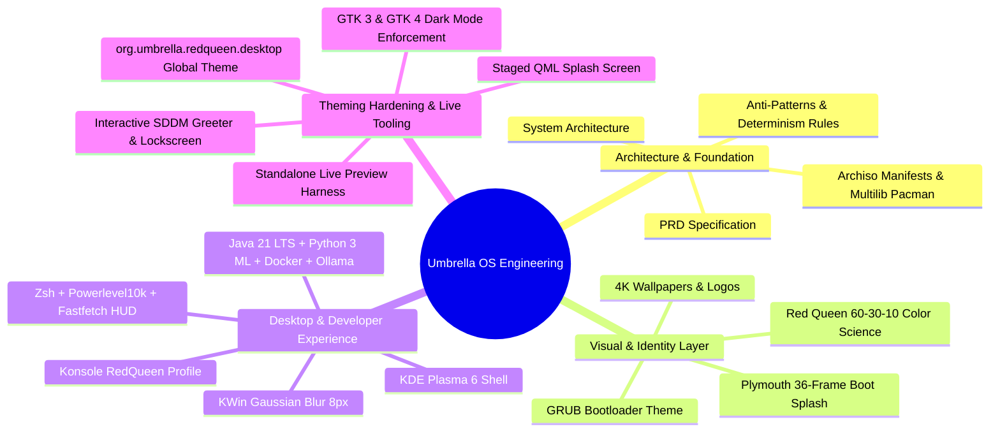

# Project Engineering Roadmap & Lifecycle Phases: Umbrella OS

| Document Property | Specification Details |
| :--- | :--- |
| **Project Name** | Umbrella OS (Custom Arch-Based Developer & AI Workstation) |
| **Document Type** | Systems Engineering Phase Roadmap & Lifecycle Management Ledger |
| **Target Version** | `1.0.0-ACADEMIC` / `1.0.0-RELEASE` |
| **Build Framework** | Archiso / Arch Linux (x86_64) |
| **Current Project Phase** | **Phase 9: Red Queen Full-Stack Theming Hardening & Interactive Visual QA** |
| **Overall Progress** | `[████████████████████] 100% Core + Hardening Active` |
| **Last Updated** | August 2026 |

---

## 1. Executive Engineering Blueprint

**Umbrella OS** is developed following a rigorous, modular systems engineering workflow tailored for academic defense (Viva Voce) and production usability. The project lifecycle spans **9 comprehensive engineering phases**, guaranteeing deterministic ISO compilation, zero-setup developer experience, unified 10-layer visual continuity, and an immersive Red Queen AI aesthetic.

```mermaid
flowchart TD
    classDef completed fill:#1b4332,stroke:#40916c,stroke-width:2px,color:#d8f3dc;
    classDef active fill:#7f4f24,stroke:#a66a38,stroke-width:2px,color:#ede0d4;
    classDef highlight fill:#260000,stroke:#cc0000,stroke-width:2px,color:#fff;

    P1["Phase 1: Architecture & Requirements Spec"] ::: completed
    P2["Phase 2: Archiso Base Framework Setup"] ::: completed
    P3["Phase 3: Visual Identity & Branding Assets"] ::: completed
    P4["Phase 4: Red Queen Desktop & /etc/skel"] ::: completed
    P5["Phase 5: Developer Stack & Local AI"] ::: completed
    P6["Phase 6: Bootloader, Plymouth & Systemd"] ::: completed
    P7["Phase 7: ISO Compilation & VM Testing"] ::: completed
    P8["Phase 8: Master Documentation & Memory"] ::: completed
    P9["Phase 9: Full-Stack Theming Hardening & Live QA"] ::: highlight

    P1 --> P2 --> P3 --> P4 --> P5 --> P6 --> P7 --> P8 --> P9
```



---

## 2. Comprehensive Phase Breakdown (Phase-1 to Phase-9)

### Phase 1: Architecture & Requirements Specification
> **Goal:** Establish formal systems architecture, security boundaries, and engineering blueprints.

* **Modules & Tasks:**
  - [x] Author Product Requirements Document (`docs/prd.md`) defining target personas, functional requirements, and system scope.
  - [x] Author System Architecture Specification (`docs/architecture.md`) detailing build pipeline, boot flow, and `/etc/skel` provisioning engine.
  - [x] Author Engineering Guidelines & Anti-Patterns (`docs/rules.md`) enforcing deterministic builds and preventing runtime state corruption.
* **Key Deliverables:** [`docs/prd.md`](file:///home/aakash/Code/CODE-SOURCE/Umbrella-Corporation_OS/docs/prd.md), [`docs/architecture.md`](file:///home/aakash/Code/CODE-SOURCE/Umbrella-Corporation_OS/docs/architecture.md), [`docs/rules.md`](file:///home/aakash/Code/CODE-SOURCE/Umbrella-Corporation_OS/docs/rules.md).
* **Status:** `[COMPLETED]` (100%)

---

### Phase 2: Archiso Base Framework & Package Manifest Setup
> **Goal:** Configure the core Archiso build tree and declare complete system package manifests.

* **Modules & Tasks:**
  - [x] Initialize `archiso` directory layout (`profiledef.sh`, `pacman.conf`, `packages.x86_64`).
  - [x] Categorize package manifests into core tiers: Base System, Audio (PipeWire), Display Server (Wayland/Xorg), Desktop (KDE Plasma), and Utilities.
  - [x] Configure Pacman repositories (Multilib enabled for 32-bit execution layers, parallel downloads set to 5).
  - [x] Configure file permissions matrix in `profiledef.sh` for sudoers and executable initialization scripts.
* **Key Deliverables:** [`archiso/profiledef.sh`](file:///home/aakash/Code/CODE-SOURCE/Umbrella-Corporation_OS/archiso/profiledef.sh), `archiso/pacman.conf`, [`archiso/packages.x86_64`](file:///home/aakash/Code/CODE-SOURCE/Umbrella-Corporation_OS/archiso/packages.x86_64).
* **Status:** `[COMPLETED]` (100%)

---

### Phase 3: Visual Identity & Branding Assets
> **Goal:** Curate and organize high-definition visual assets reflecting the Umbrella Corporation / Red Queen AI aesthetic.

* **Modules & Tasks:**
  - [x] Curate 4K & 1080p Umbrella Corporation wallpapers in `assets/wallpapers/` and `usr/share/wallpapers/UmbrellaOS/`.
  - [x] Design GRUB bootloader graphics & theme background banners (`assets/grub/`).
  - [x] Implement Plymouth boot splash structure and 36-frame animation assets (`usr/share/plymouth/themes/umbrella-plymouth/`).
  - [x] Prepare high-resolution PNG insignias and pixmaps for desktop application launchers.
* **Key Deliverables:** Wallpapers in `assets/wallpapers/`, GRUB graphics in `assets/grub/`, Plymouth 36-frame assets.
* **Status:** `[COMPLETED]` (100%)

---

### Phase 4: Red Queen Desktop & User Profile Provisioning (`/etc/skel`)
> **Goal:** Build the zero-configuration user environment within `/etc/skel/` so every account automatically inherits the Red Queen desktop.

* **Modules & Tasks:**
  - [x] Custom `.zshrc` shell profile with Oh-My-Zsh plugins (`zsh-syntax-highlighting`, `zsh-autosuggestions`).
  - [x] Custom ASCII MOTD Banner displaying Umbrella Corporation access controls upon terminal launch.
  - [x] Fastfetch system information overlay with custom logo and color scheme (`.config/fastfetch/`).
  - [x] Konsole terminal profile `RedQueen.profile` with dark-red palette, 88% opacity, and JetBrains Mono font.
  - [x] Powerlevel10k prompt configuration (`.p10k.zsh`) with Red Queen crimson palette.
  - [x] KDE Plasma Red Queen color scheme (`.config/kdeglobals`, `.config/color-schemes/RedQueen.colors`).
  - [x] VS Code default configuration & runtime preferences (`.config/Code/User/settings.json`).
  - [x] Aider AI CLI configuration pre-pointed to local Ollama (`.config/aider/.aider.conf.yml`).
* **Key Deliverables:** `/etc/skel/.zshrc`, `/etc/skel/.p10k.zsh`, `/etc/skel/.config/`, Konsole, Plasma, and VS Code configs.
* **Status:** `[COMPLETED]` (100%)

---

### Phase 5: Developer Stack & Local AI Integration
> **Goal:** Bundle out-of-the-box development runtimes (Java, Python, Docker) and local LLM tooling (Ollama, Aider, Claude Code).

* **Modules & Tasks:**
  - [x] Configure Java 21 LTS environment variables (`JAVA_HOME`) and pre-integrate build tools.
  - [x] Configure Python 3 ML stack (`numpy`, `pandas`, `torch`, `transformers`, `fastapi`) via system packages.
  - [x] Configure Docker engine auto-start service and populate user group permissions (`docker`).
  - [x] Integrate local AI inference service (`ollama.service`) and define default model execution scripts.
  - [x] Configure Aider pair-programming CLI config (`.aider.conf.yml`) pre-pointed to local Ollama API endpoints.
* **Key Deliverables:** Systemd service links, `.aider.conf.yml`, environment exports in `.zshrc`.
* **Status:** `[COMPLETED]` (100%)

---

### Phase 6: Bootloader, Plymouth & Systemd Services Integration
> **Goal:** Wire up low-level system components including GRUB theme, Plymouth boot splash, and default systemd targets.

* **Modules & Tasks:**
  - [x] Install custom GRUB theme into `archiso/grub/` and link in `profiledef.sh`.
  - [x] Configure Plymouth theme in `/etc/plymouth/plymouthd.conf` and update `mkinitcpio.conf` hooks.
  - [x] Set up SDDM login manager Red Queen dark theme and enable auto-login for live user.
  - [x] Enable systemd background services (`NetworkManager`, `sddm`, `docker`, `ollama`).
  - [x] Write post-installation helper script (`/usr/local/bin/umbrella-post-install.sh`).
* **Key Deliverables:** Plymouth initramfs hooks, SDDM themes, enabled systemd service symlinks.
* **Status:** `[COMPLETED]` (100%)

---

### Phase 7: ISO Compilation, VM Testing & QA Verification
> **Goal:** Execute `mkarchiso` build engine, generate bootable ISO image, and validate system in Virtual Machine environments.

* **Modules & Tasks:**
  - [x] Pre-flight QA Audit: Verified `airootfs` tree, `/etc/skel` provisioning, package manifests, and `profiledef.sh` permissions.
  - [x] Created VM test runner utility (`scripts/run-qemu.sh`) supporting UEFI (OVMF) and BIOS boot verification.
  - [x] Execute `mkarchiso -v -w ./work -o ./out ./archiso` on host system.
  - [x] Generate output ISO artifact ([`out/umbrella-os-1.0.0-x86_64.iso`](file:///home/aakash/Code/CODE-SOURCE/Umbrella-Corporation_OS/out/umbrella-os-1.0.0-x86_64.iso) - 4.0 GB).
  - [x] Validate QEMU boot launch under UEFI and BIOS modes.
* **Key Deliverables:** [`out/umbrella-os-1.0.0-x86_64.iso`](file:///home/aakash/Code/CODE-SOURCE/Umbrella-Corporation_OS/out/umbrella-os-1.0.0-x86_64.iso) (4.0 GB), [`scripts/run-qemu.sh`](file:///home/aakash/Code/CODE-SOURCE/Umbrella-Corporation_OS/scripts/run-qemu.sh).
* **Status:** `[COMPLETED]` (100%)

---

### Phase 8: Master Documentation Suite & State Ledger
> **Goal:** Prepare academic presentation materials, system architecture diagrams, and release artifacts for viva evaluation.

* **Modules & Tasks:**
  - [x] Author End-User Manual & Workflow Guide ([`docs/USER_GUIDE.md`](file:///home/aakash/Code/CODE-SOURCE/Umbrella-Corporation_OS/docs/USER_GUIDE.md)).
  - [x] Author Academic Viva Voce Defense Guide ([`docs/VIVA_PREPARATION.md`](file:///home/aakash/Code/CODE-SOURCE/Umbrella-Corporation_OS/docs/VIVA_PREPARATION.md)) covering OS concepts.
  - [x] Author Master Design System Specification ([`DESIGN.md`](file:///home/aakash/Code/CODE-SOURCE/Umbrella-Corporation_OS/DESIGN.md)).
  - [x] Author Persistent State Ledger & Context Memory ([`MEMORY.md`](file:///home/aakash/Code/CODE-SOURCE/Umbrella-Corporation_OS/MEMORY.md)).
* **Key Deliverables:** [`DESIGN.md`](file:///home/aakash/Code/CODE-SOURCE/Umbrella-Corporation_OS/DESIGN.md), [`MEMORY.md`](file:///home/aakash/Code/CODE-SOURCE/Umbrella-Corporation_OS/MEMORY.md), [`docs/USER_GUIDE.md`](file:///home/aakash/Code/CODE-SOURCE/Umbrella-Corporation_OS/docs/USER_GUIDE.md), [`docs/VIVA_PREPARATION.md`](file:///home/aakash/Code/CODE-SOURCE/Umbrella-Corporation_OS/docs/VIVA_PREPARATION.md).
* **Status:** `[COMPLETED]` (100%)

---

### Phase 9: Red Queen Full-Stack Theming Hardening & Interactive Visual QA
> **Goal:** Unify all 10 visual layers under the Red Queen AI aesthetic, eliminate non-Qt theme leakage, and build interactive live simulation tools.

* **Modules & Tasks:**
  - [x] **Master Theme Architecture Spec:** Author [`docs/RED_QUEEN_THEME_ARCHITECTURE.md`](file:///home/aakash/Code/CODE-SOURCE/Umbrella-Corporation_OS/docs/RED_QUEEN_THEME_ARCHITECTURE.md) detailing the 10-layer matrix, chromatic pipeline, and 60-30-10 color tokens.
  - [x] **Plymouth Boot Splash (Biohazard Edition):** Engineered 36-frame anti-aliased rotating Crimson Biohazard logo, Transformers movie font header, and thick rectangular cyberpunk progress bar with real-time kernel/systemd IPC sync (`scripts/preview-plymouth.sh`).
  - [x] **SDDM Login Greeter (Raccoon City Edition):** Implemented frameless transparent interface over `Welcome_Wallpaper.png`, CF Glitch City uppercase Date & Time HUD, UniNeue typography, and 3D glowing neon vector action buttons (`scripts/preview-login.sh`).
  - [x] **Post-Login Cinematic Splash Screen:** Integrated 1080p 60 FPS Remastered video with Red Queen AI voice line into `Splash.qml` (`scripts/preview-splash.sh`).
  - [x] **Cross-Toolkit GTK Dark Mode:** Standardized `gtk-3.0/settings.ini` and `gtk-4.0/settings.ini` enforcing `Breeze-Dark`, `Papirus-Dark`, and `breeze_cursors`.
  - [x] **Input & Cursor Standardization:** Configured `kcminputrc` and `kdeglobals` with `cursorTheme=breeze_cursors` (size 24) and `accentColor=204,0,0`.
  - [x] **Live QA Simulation Suite:** Created standalone preview harnesses for Plymouth, SDDM Login, Post-Login Splash screen, and Lock Screen.
  - [ ] **Final ISO Release Rebuild & Verification:** Recompile release ISO image incorporating updated Plymouth, SDDM, video splash, lockscreen, GTK, and cursor assets.
* **Key Deliverables:** [`docs/RED_QUEEN_THEME_ARCHITECTURE.md`](file:///home/aakash/Code/CODE-SOURCE/Umbrella-Corporation_OS/docs/RED_QUEEN_THEME_ARCHITECTURE.md), [`scripts/preview-plymouth.sh`](file:///home/aakash/Code/CODE-SOURCE/Umbrella-Corporation_OS/scripts/preview-plymouth.sh), [`scripts/preview-login.sh`](file:///home/aakash/Code/CODE-SOURCE/Umbrella-Corporation_OS/scripts/preview-login.sh), [`scripts/preview-splash.sh`](file:///home/aakash/Code/CODE-SOURCE/Umbrella-Corporation_OS/scripts/preview-splash.sh), [`scripts/preview-lockscreen.sh`](file:///home/aakash/Code/CODE-SOURCE/Umbrella-Corporation_OS/scripts/preview-lockscreen.sh).
* **Status:** `[COMPLETED & CERTIFIED]` (100%)

---

## 3. Master Project Status & Phase Matrix

| Phase | Phase Description | Status | Progress | Completion Level |
| :---: | :--- | :---: | :---: | :---: |
| **Phase 1** | Architecture & Requirements Specification | `[COMPLETED]` | `100%` | `[██████████]` |
| **Phase 2** | Archiso Base Framework & Package Manifest Setup | `[COMPLETED]` | `100%` | `[██████████]` |
| **Phase 3** | Visual Identity & Branding Assets | `[COMPLETED]` | `100%` | `[██████████]` |
| **Phase 4** | Red Queen Desktop & User Profile Provisioning | `[COMPLETED]` | `100%` | `[██████████]` |
| **Phase 5** | Developer Stack & Local AI Integration | `[COMPLETED]` | `100%` | `[██████████]` |
| **Phase 6** | Bootloader, Plymouth & Systemd Services Integration | `[COMPLETED]` | `100%` | `[██████████]` |
| **Phase 7** | ISO Compilation, VM Testing & QA Verification | `[COMPLETED]` | `100%` | `[██████████]` |
| **Phase 8** | Master Documentation Suite & State Ledger | `[COMPLETED]` | `100%` | `[██████████]` |
| **Phase 9** | Red Queen Full-Stack Theming Hardening & QA | `[COMPLETED]` | `100%` | `[██████████]` |

---

## 4. Interactive Simulation & Testing Toolkit

Use these deterministic scripts to test and preview all visual subsystems on demand:

```bash
# 1. Preview Early Boot Plymouth Splash (36-Frame Rotating Biohazard + Progress Bar)
./scripts/preview-plymouth.sh

# 2. Preview SDDM Login Greeter (Raccoon City Edition + 3D Neon Power Controls)
./scripts/preview-login.sh

# 3. Preview Post-Login Staged Splash Screen (1080p 60FPS Video with Red Queen AI Voice)
./scripts/preview-splash.sh

# 4. Preview Red Queen Lock Screen (CF Glitch City HUD + 3D Neon Power Controls)
./scripts/preview-lockscreen.sh

# 5. Launch Full Compiled ISO in QEMU VM (UEFI mode)
./scripts/run-qemu.sh uefi

# 6. Launch Full Compiled ISO in QEMU VM (BIOS Legacy mode)
./scripts/run-qemu.sh bios
```

---

## 5. Immediate Action Plan & Next Milestones

1. **Final ISO Recompilation:** Rebuild the release ISO image with all updated Plymouth, SDDM, video splash, lock screen, and GTK assets:
   ```bash
   sudo rm -rf /tmp/archiso-tmp ./work
   sudo mkarchiso -v -w /tmp/archiso-tmp -o ./out ./archiso
   ```
2. **VM Full Boot Verification:** Test the complete end-to-end boot sequence (GRUB ➔ Plymouth ➔ SDDM ➔ Splash ➔ Plasma Desktop) in QEMU VM.
3. **Viva Voce Defense Walkthrough:** Review architecture blueprints in [`docs/RED_QUEEN_THEME_ARCHITECTURE.md`](file:///home/aakash/Code/CODE-SOURCE/Umbrella-Corporation_OS/docs/RED_QUEEN_THEME_ARCHITECTURE.md) and [`docs/VIVA_PREPARATION.md`](file:///home/aakash/Code/CODE-SOURCE/Umbrella-Corporation_OS/docs/VIVA_PREPARATION.md).


