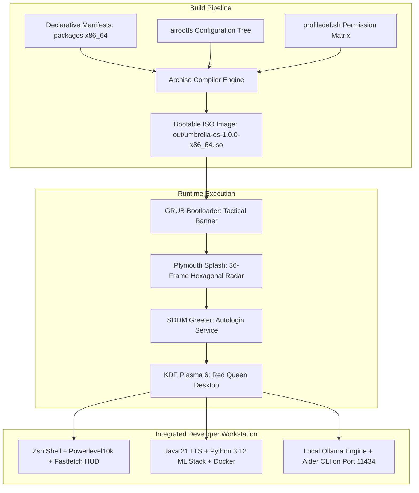
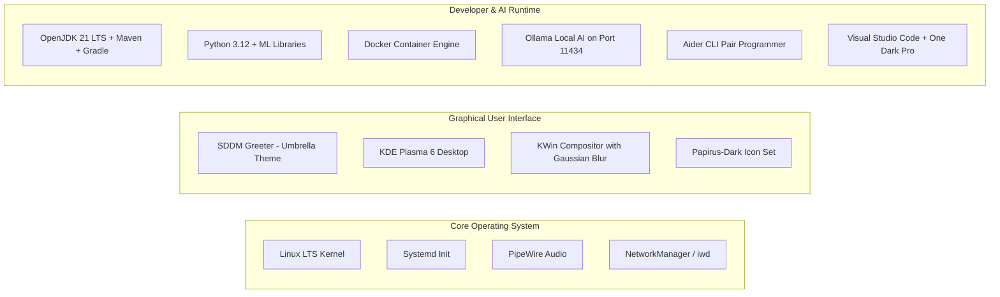

# Umbrella OS

**Custom Arch-Based Developer & Local AI Workstation**

| Specification | Details |
| :--- | :--- |
| **System Architecture** | x86_64 (AMD64) |
| **Base Distribution** | Arch Linux (Rolling Base) |
| **Build Framework** | Archiso (Declarative Bootstrap & SquashFS Compression) |
| **Target Version** | `1.0.0-RELEASE` |
| **Desktop Environment** | KDE Plasma 6 on Wayland / X11 |
| **Visual Architecture** | Red Queen Dark Theme (`#0A0A0A` Canvas / `#CC0000` Accent) |
| **Default Live User** | `umbrella` (Password: `umbrella`, Passwordless Sudo) |
| **Compiled ISO Output** | `out/umbrella-os-1.0.0-x86_64.iso` (4.24 GB) |

---

## 1. Executive Summary

Umbrella OS is an autonomous, bootable Linux workstation distribution engineered for software developers, systems engineers, and artificial intelligence researchers. Compiled using the `archiso` pipeline, the operating system delivers a complete, zero-configuration runtime out-of-the-box, eliminating the setup friction associated with vanilla Linux installations.

The operating system combines a dark aesthetic inspired by the fictional Umbrella Corporation and the Red Queen AI with a pre-configured software development stack (Java 21 LTS, Python 3.12, Docker, Ollama local inference, Aider pair-programming, and VS Code).



---

## 2. Quick Start and Installation

### 2.1 Compiling the ISO from Source

Ensure you are running on an Arch Linux host machine with `archiso` and `git` installed:

```bash
# 1. Install prerequisites on host
sudo pacman -S --needed archiso git qemu-full edk2-ovmf

# 2. Clone repository
git clone https://github.com/Aak4shz/Umbrella-Corporation_OS.git
cd Umbrella-Corporation_OS

# 3. Build the ISO image
sudo mkarchiso -v -w /tmp/archiso-tmp -o ./out ./archiso
```

### 2.2 Virtual Machine Testing

Test the generated ISO immediately using the included pre-flight QEMU runner:

```bash
# Launch in UEFI mode (recommended)
./scripts/run-qemu.sh uefi

# Launch in BIOS legacy mode
./scripts/run-qemu.sh bios
```

### 2.3 Flashing to Physical USB Storage

```bash
# Write directly to a USB drive (replace /dev/sdX with your target drive)
sudo dd bs=4M if=./out/umbrella-os-1.0.0-x86_64.iso of=/dev/sdX status=progress oflag=sync
```

---

## 3. Master Documentation Index

Umbrella OS features a modular documentation suite. Refer to the specialized documents below for comprehensive technical details:

| Document | Primary Focus & Description |
| :--- | :--- |
| **[DESIGN.md](DESIGN.md)** | **Complete A-Z Design System Specification:** Color tokens (`#CC0000`, `#0A0A0A`), typography scale (Roboto / JetBrains Mono), spatial grid, KWin blur compositing, SDDM greeter, Plymouth boot splash, Konsole ANSI matrix, and WCAG accessibility standards. |
| **[MEMORY.md](MEMORY.md)** | **Project State Ledger & Command Center:** Master project memory, quick context restoration, deterministic command log, file tracking, troubleshooting gotchas, and rebuild protocols. |
| **[PHASES.md](PHASES.md)** | **Engineering Lifecycle Roadmap:** 8-phase execution roadmap from architecture to final ISO release packaging and verification. |
| **[docs/prd.md](docs/prd.md)** | **Product Requirements Document (PRD):** Persona definitions (Java Developer, AI Researcher, Viva Evaluator), functional scope, and user stories. |
| **[docs/architecture.md](docs/architecture.md)** | **System Architecture Specification:** Build-time pipelines, boot sequence, `/etc/skel` provisioning engine, and service dependency graphs. |
| **[docs/rules.md](docs/rules.md)** | **Engineering Standards & Anti-Patterns:** Declarative build rules, package hygiene, and anti-patterns for deterministic systems engineering. |
| **[docs/USER_GUIDE.md](docs/USER_GUIDE.md)** | **End-User Manual & Shortcuts:** Desktop shortcuts, shell aliases (`ai`, `aider`, `venv`, `jrun`), privacy apps, and AI pairing instructions. |
| **[docs/VIVA_PREPARATION.md](docs/VIVA_PREPARATION.md)** | **Academic Viva Voce Defense Guide:** Technical Q&A defense handbook mapping Umbrella OS features to core Operating System concepts. |
| **[docs/LIVE_USER_AUTOLOGIN_PLAN.md](docs/LIVE_USER_AUTOLOGIN_PLAN.md)** | **Live User Autologin Architecture:** Technical specification for live account initialization, groups assignment, and SDDM autologin orchestration. |

---

## 4. Live Session Environment and Credentials

When booted into the live environment, Umbrella OS automatically signs into the desktop session:

| Parameter | Value / Setting |
| :--- | :--- |
| **Live Username** | `umbrella` |
| **Live Password** | `umbrella` |
| **Root Password** | `umbrella` |
| **Sudo Privileges** | Full passwordless sudo (`ALL=(ALL:ALL) NOPASSWD: ALL`) |
| **Display Session** | KDE Plasma 6 (Wayland with X11 fallback) |
| **Audio Subsystem** | PipeWire + WirePlumber (Low-latency audio) |
| **Default Shell** | Zsh 5.9 + Oh-My-Zsh + Powerlevel10k |
| **Default Terminal** | Konsole (`Red Queen` profile with 88% opacity blur) |

---

## 5. Technology Stack and Bundled Tooling



### 5.1 Software Engineering Tooling
* **Java Stack:** OpenJDK 21 LTS pre-configured with `JAVA_HOME`, Maven (`mvn`), and Gradle.
* **Python Stack:** Python 3.12 with `pip`, `virtualenv`, and core scientific packages (`numpy`, `pandas`, `torch`, `transformers`, `fastapi`, `uvicorn`).
* **Containerization:** Docker 27.x engine pre-installed with user socket permissions.
* **Code Editors:** Visual Studio Code with pre-configured settings (`One Dark Pro`, JetBrains Mono ligatures, smooth block cursor, bracket pairing), Neovim, and Nano.

### 5.2 Local Artificial Intelligence Engine
* **Ollama Daemon:** Pre-installed systemd service (`ollama.service`) exposing local REST endpoints at `http://127.0.0.1:11434`.
* **Aider CLI:** Terminal pair-programmer pre-configured (`.config/aider/.aider.conf.yml`) to communicate directly with local Ollama model instances.
* **Claude Code CLI:** Anthropic developer CLI pre-integrated for cloud-assisted engineering sessions.

### 5.3 Privacy and Secure Communication
* **Encrypted Communication Tools:** Signal Desktop, Element (Matrix), Session Messenger, SimpleX Chat, and Briar offline mesh communicator.

---

## 6. Directory Structure

```text
Umbrella-Corporation_OS/
├── DESIGN.md                          # Master A-Z Design System Specification
├── MEMORY.md                          # Master Project Memory & State Ledger
├── PHASES.md                          # 8-Phase Engineering Lifecycle Roadmap
├── README.md                          # Executive Project Overview & Navigation Hub
├── archiso/                           # Archiso Build Directory
│   ├── pacman.conf                    # Pacman Repositories & Parallel Downloads
│   ├── packages.x86_64                # Complete Declarative Package Manifest
│   ├── profiledef.sh                  # Archiso Profile Definition & Permissions
│   └── airootfs/                      # Root Filesystem Overlay Tree
│       ├── etc/                       # System Configurations & Skeletons (/etc/skel)
│       └── usr/                       # System Themes, SDDM, Plymouth, Wallpapers
├── assets/                            # Raw Source Media, GRUB Banners & Wallpapers
├── docs/                              # Project Technical Documentation Suite
│   ├── LIVE_USER_AUTOLOGIN_PLAN.md    # Live User Autologin Architecture
│   ├── USER_GUIDE.md                  # End-User Manual & Shortcuts
│   ├── VIVA_PREPARATION.md            # Academic Viva Voce Defense Guide
│   ├── architecture.md                # System Architecture Specification
│   ├── prd.md                         # Product Requirements Document
│   └── rules.md                       # Engineering Standards & Anti-Patterns
├── out/                               # Compiled Distribution Output
│   └── umbrella-os-1.0.0-x86_64.iso   # Bootable ISO Binary (4.24 GB)
├── scripts/                           # Automation & Verification Scripts
│   └── run-qemu.sh                    # QEMU Virtual Machine Test Script
└── work/                              # Archiso Temporary Build Cache
```

---

## 7. License and Credits

* **Base Framework:** Built on [Arch Linux](https://archlinux.org/) using the `archiso` tooling.
* **Desktop Environment:** [KDE Plasma](https://kde.org/plasma-desktop/) and [KWin](https://invent.kde.org/plasma/kwin).
* **Terminal & Shell:** [Oh My Zsh](https://ohmyz.sh/), [Powerlevel10k](https://github.com/romkatv/powerlevel10k), and [Fastfetch](https://github.com/fastfetch-cli/fastfetch).
* **Typography:** [JetBrains Mono](https://www.jetbrains.com/lp/mono/) and [Roboto](https://fonts.google.com/specimen/Roboto).
* **Design Theme:** Red Queen Interface inspired by the Umbrella Corporation aesthetic from the *Resident Evil* universe.
