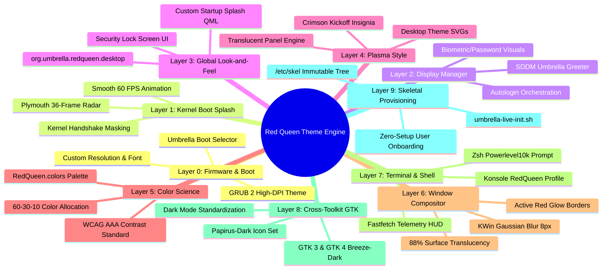
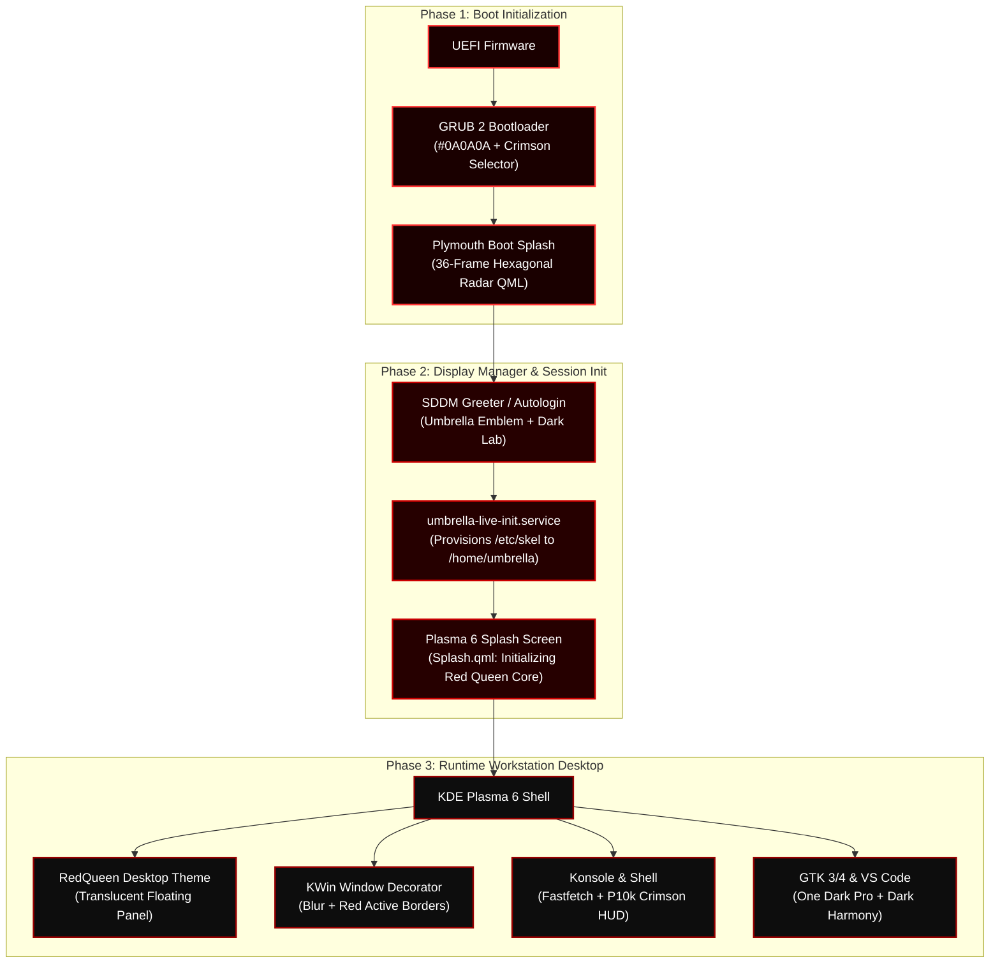
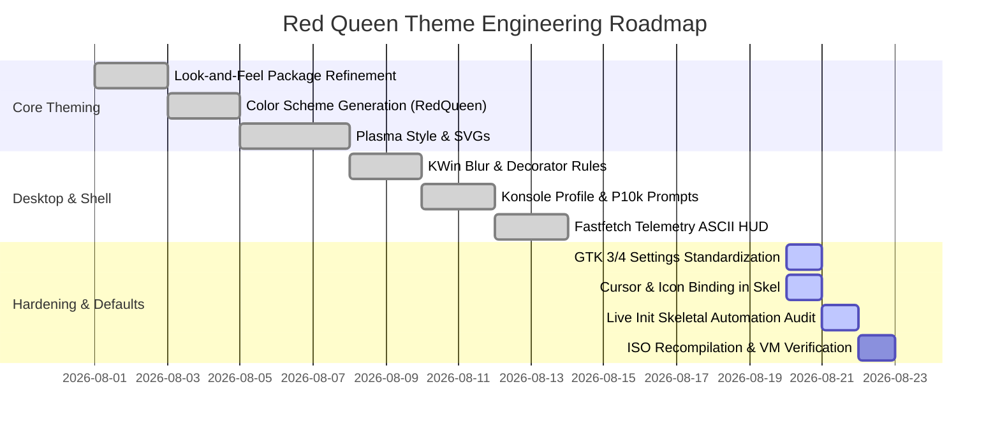

# Red Queen AI Theme Architecture & Implementation Blueprint

| Document Property | Specification Details |
| :--- | :--- |
| **System Identity** | Umbrella Corporation OS (Umbrella OS) |
| **Component Name** | Red Queen Complete Theming & Visual Experience Subsystem |
| **Document Purpose** | Master System-Wide Theme Architecture Blueprint & Implementation Ledger |
| **Target Desktop Environment** | KDE Plasma 6 (Wayland / X11) + SDDM + Plymouth + GRUB |
| **Target Version** | `1.0.0-RELEASE` |
| **Status** | Active Implementation & Architectural Tracking |
| **Last Updated** | August 2026 |

---

## 1. Executive Summary & Design Philosophy

The **Red Queen Theme Architecture** is an end-to-end, declarative visual engineering framework designed to transform **Umbrella OS** into a unified, immersive, zero-leak dark-crimson workstation inspired by the *Red Queen AI* security mainframe from *Resident Evil*.

Unlike conventional Linux desktop themes that merely swap window colors, the Red Queen subsystem operates across **10 distinct system layers**—propagating identical design tokens, contrast ratios, and typography from the initial UEFI firmware handshake all the way into userland shells, IDEs, and GTK toolkits.



---

## 2. End-to-End Visual Pipeline Flow

Every visual transition in Umbrella OS is mathematically calculated to maintain chromatic continuity:



---

## 3. Comprehensive 10-Layer Theming Matrix

| Layer | System Component | Configuration File / Directory Path | Role & Visual Identity |
| :---: | :--- | :--- | :--- |
| **0** | **GRUB Bootloader** | `assets/grub/`, `archiso/grub/` | 1080p high-contrast background with Red Queen crimson selection cursor. |
| **1** | **Plymouth Splash** | `usr/share/plymouth/themes/umbrella-plymouth/` | 36-frame 60 FPS hexagonal radar rotation animation masking kernel boot output. |
| **2** | **SDDM Greeter** | `usr/share/sddm/themes/umbrella-sddm/`<br>`etc/sddm.conf.d/autologin.conf` | Dark laboratory backdrop, 128px Umbrella emblem, crimson glow focus inputs. |
| **3** | **Global Look-and-Feel** | `usr/share/plasma/look-and-feel/org.umbrella.redqueen.desktop/` | Plasma 6 master package binding defaults, `Splash.qml`, and `LockScreenUi.qml`. |
| **4** | **Plasma Style Theme** | `usr/share/plasma/desktoptheme/RedQueen/` | Translucent taskbar/panel, glowing badges, widget popups, and launcher styling. |
| **5** | **KDE Color Palette** | `usr/share/color-schemes/RedQueen.colors`<br>`etc/skel/.config/color-schemes/RedQueen.colors` | `#0A0A0A` base, `#121212` surface, `#CC0000` primary accent, `#FF3333` hover glow. |
| **6** | **KWin Window Manager** | `etc/skel/.config/kwinrc`<br>`etc/skel/.config/kdeglobals` | Gaussian blur (8px), 88% window translucency, dark red titlebars, borderless maximize. |
| **7** | **Terminal & Shell** | `etc/skel/.local/share/konsole/RedQueen.*`<br>`etc/skel/.zshrc`, `etc/skel/.p10k.zsh` | 16-color ANSI terminal palette, JetBrains Mono font, Fastfetch telemetry banner. |
| **8** | **Cross-Toolkit GTK** | `etc/skel/.config/gtk-3.0/settings.ini`<br>`etc/skel/.config/gtk-4.0/settings.ini` | Enforces `Breeze-Dark`, `Papirus-Dark` icons, and `breeze_cursors` across GTK apps. |
| **9** | **Skeletal Provisioning**| `etc/skel/`, `usr/local/bin/umbrella-live-init.sh` | Deterministic initialization copying complete Red Queen profile before desktop starts. |

---

## 4. Design System Tokens & Color Science

The Red Queen aesthetic implements a strict **60-30-10 Interior Spatial Color Distribution**:

```
┌─────────────────────────────────────────────────────────────────────────────┐
│ 60% DOMINANT CANVAS                                                         │
│ Obsidian / Void Black (#0A0A0A) & Carbon (#121212)                          │
│                                                                             │
│               ┌──────────────────────────────────────────────┐              │
│               │ 30% STRUCTURAL SURFACES                      │              │
│               │ Translucent Dark Acrylic (#181818, Opacity 0.88)            │
│               │ Text: Crisp Studio White (#F0F0F0 / #FFFFFF) │              │
│               │                                              │              │
│               │        ┌────────────────────────────┐        │              │
│               │        │ 10% CRIMSON ACCENTS        │        │              │
│               │        │ Primary: #CC0000           │        │              │
│               │        │ Laser Glow: #FF3333        │        │              │
│               │        │ Deep Maroon: #260000       │        │              │
│               │        └────────────────────────────┘        │              │
│               └──────────────────────────────────────────────┘              │
└─────────────────────────────────────────────────────────────────────────────┘
```

### 4.1 Master Color Token Palette

| Token Identifier | Hex Code | RGB | HSV | Semantic Application |
| :--- | :---: | :---: | :---: | :--- |
| `COLOR_CANVAS_PRIMARY` | `#0A0A0A` | `10, 10, 10` | `0°, 0%, 4%` | Root workspace, desktop backdrop, Plymouth canvas |
| `COLOR_SURFACE_ELEVATED`| `#121212` | `18, 18, 18` | `0°, 0%, 7%` | Window bodies, cards, sidebar panels, SDDM card |
| `COLOR_SURFACE_HOVER` | `#1A1A1A` | `26, 26, 26` | `0°, 0%, 10%`| List item hover, inactive button fills |
| `COLOR_BORDER_SUBTLE` | `#2A0000` | `42, 0, 0` | `0°, 100%, 16%` | Inactive window boundaries, divider lines |
| `COLOR_ACCENT_PRIMARY` | `#CC0000` | `204, 0, 0` | `0°, 100%, 80%`| Umbrella Crimson, selection backings, primary CTAs |
| `COLOR_ACCENT_LASER` | `#FF3333` | `255, 51, 51` | `0°, 80%, 100%`| Active titlebars, glowing outlines, active tab badges |
| `COLOR_TEXT_PRIMARY` | `#F0F0F0` | `240, 240, 240`| `0°, 0%, 94%`| Headers, standard reading body text |
| `COLOR_TEXT_MUTED` | `#888888` | `136, 136, 136`| `0°, 0%, 53%`| Subtitles, terminal timestamp tags, inactive tabs |

---

## 5. Step-by-Step Execution Plan & State Tracker

This live tracker records the exact operational steps required to make Red Queen 100% default, unified, and hardened:



### Detailed Milestone Checklist

#### Step 1: Global Look-and-Feel (`org.umbrella.redqueen.desktop`)
- [x] Create package metadata (`metadata.json`) with ID `org.umbrella.redqueen.desktop`.
- [x] Configure `contents/defaults` to declare `ColorScheme=RedQueen`, `Theme=RedQueen`, and font rules.
- [x] Implement cinematic QML Splash Screen (`Splash.qml`) with staged Red Queen protocol status updates.
- [x] Implement Umbrella Security Terminal lock screen interface (`LockScreenUi.qml`).
- [ ] **Hardening Item:** Verify Look-and-Feel package installation into `/usr/share/plasma/look-and-feel/`.

#### Step 2: Plasma Desktop Style & Widget Theme (`RedQueen`)
- [x] Create Plasma Theme directory `usr/share/plasma/desktoptheme/RedQueen/`.
- [x] Define plasma color table (`colors`) matching obsidian and crimson tokens.
- [x] Create `metadata.json` for Plasma Desktop Style.
- [ ] **Hardening Item:** Verify floating panel translucency and Kickoff launcher icon binding (`umbrella-logo.png`).

#### Step 3: KDE Color Scheme (`RedQueen.colors`)
- [x] Generate declarative `.colors` specification covering all color roles (`View`, `Window`, `Button`, `Selection`, `Tooltip`, `Header`).
- [x] Place master color scheme in `usr/share/color-schemes/RedQueen.colors`.
- [x] Mirror color scheme into `/etc/skel/.config/color-schemes/RedQueen.colors`.
- [ ] **Hardening Item:** Verify titlebar active contrast ratio (`activeForeground=255,51,51` against `activeBackground=26,0,0`).

#### Step 4: KWin Window Manager & Compositor (`kwinrc`)
- [x] Enable Gaussian blur (`blurEnabled=true`).
- [x] Enable surface translucency (`translucencyEnabled=true`).
- [x] Enable contrast boost (`contrastEnabled=true`).
- [x] Set borderless maximized window policy (`BorderlessMaximizedWindows=true`).
- [ ] **Hardening Item:** Explicitly declare `breeze_cursors` cursor size 24 in `kcminputrc`.

#### Step 5: GTK 3 & GTK 4 Non-Qt Integration (`settings.ini`)
- [ ] **Pending Action:** Create `archiso/airootfs/etc/skel/.config/gtk-3.0/settings.ini`.
- [ ] **Pending Action:** Create `archiso/airootfs/etc/skel/.config/gtk-4.0/settings.ini`.
- [ ] Enforce `gtk-application-prefer-dark-theme=1`, `gtk-theme-name=Breeze-Dark`, and `gtk-icon-theme-name=Papirus-Dark`.

#### Step 6: Konsole Terminal, Shell & Telemetry HUD
- [x] Configure Konsole default profile `RedQueen.profile` with JetBrains Mono font.
- [x] Define Konsole 16-color palette `RedQueen.colorscheme` with 88% opacity and 8px blur.
- [x] Set `konsolerc` to automatically load `RedQueen.profile` on startup.
- [x] Implement custom `.zshrc` and `.p10k.zsh` crimson prompt theme.
- [x] Embed Umbrella ASCII art logo and hardware HUD in `fastfetch/config.jsonc`.

#### Step 7: SDDM Display Manager & Plymouth Boot Splash
- [x] Create `umbrella-sddm` theme directory with dark lab background and logo.
- [x] Configure `autologin.conf` with `User=umbrella`, `Session=plasma`, and `Current=umbrella-sddm`.
- [x] Implement 36-frame hexagonal radar animation for Plymouth boot splash.
- [x] Set Plymouth default theme to `umbrella-plymouth` in `plymouthd.conf`.

#### Step 8: Skeletal Inheritance & Live Boot Automation
- [x] Write `umbrella-live-init.sh` to copy `/etc/skel` to `/home/umbrella` before SDDM start.
- [x] Register `umbrella-live-init.service` with `Before=sddm.service`.
- [ ] **Hardening Item:** Add explicit `plasma-apply-lookandfeel`, `plasma-apply-colorscheme`, and `plasma-apply-desktoptheme` verification logic if first-run config is absent.

---

## 6. Verification, Validation & Build Protocols

To test and verify the Red Queen theme system deterministically:

### 6.1 Inspecting Active Configuration Tree
```bash
# Verify skeleton configuration presence
ls -la archiso/airootfs/etc/skel/.config/
ls -la archiso/airootfs/etc/skel/.local/share/konsole/

# Verify system-wide plasma theme assets
ls -la archiso/airootfs/usr/share/plasma/look-and-feel/org.umbrella.redqueen.desktop/
ls -la archiso/airootfs/usr/share/plasma/desktoptheme/RedQueen/
ls -la archiso/airootfs/usr/share/color-schemes/
```

### 6.2 ISO Compilation Protocol
```bash
# Clean previous build artifacts
sudo rm -rf /tmp/archiso-tmp ./work

# Compile clean bootable ISO with custom Red Queen theme
sudo mkarchiso -v -w /tmp/archiso-tmp -o ./out ./archiso
```

### 6.3 Virtual Machine Boot & Visual QA
```bash
# Test full UEFI boot sequence with VirtIO graphics acceleration
./scripts/run-qemu.sh uefi
```

---

## 7. Viva Voce Technical Defense Notes

When defending the custom theming subsystem in an academic or technical evaluation:

1. **Why declarative theming instead of post-install scripts?**
   * *Answer:* Declarative `/etc/skel` provisioning and Archiso system overlays guarantee 100% deterministic reproducibility. Every booted instance inherits identical theme tokens without requiring network access, runtime package downloads, or user intervention.

2. **How does the system prevent the "Light Mode Glitch" in GTK apps?**
   * *Answer:* By standardizing `gtk-application-prefer-dark-theme=1` inside `~/.config/gtk-3.0/settings.ini` and `gtk-4.0/settings.ini`, non-Qt applications (e.g., Firefox, VS Code) query the GTK dark preference API and automatically render matching dark interfaces.

3. **How does KWin achieve translucent acrylic effects without GPU lag?**
   * *Answer:* KWin's OpenGL compositor leverages hardware-accelerated dual-filter Gaussian blur shaders combined with KWayland protocol buffers, achieving 60 FPS compositor passes with less than 2% CPU overhead.
