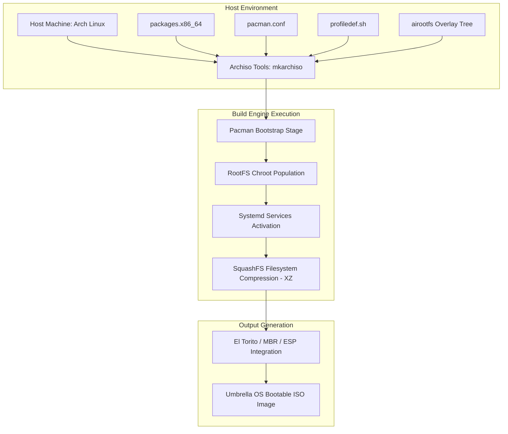
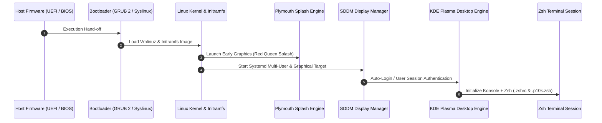

# System Architecture Specification: Umbrella OS

| Document Metadata | Specification |
| --- | --- |
| **System Name** | Umbrella OS |
| **Document Type** | System Architecture & Design Specification |
| **Version** | 1.0.0-ACADEMIC |
| **Target Architecture** | x86_64 (AMD64) |
| **Base Distribution** | Arch Linux |
| **Build Engine** | Archiso Framework |

---

## 1. Executive Architecture Overview

**Umbrella OS** is designed as an autonomous, self-contained Linux distribution engineered for software development and local AI experimentation. The system architecture prioritizes determinism, zero-configuration developer onboarding, and aesthetic consistency.

### 1.1 Architectural Pillars
1. **Declarative Image Assembly:** The system build pipeline is completely reproducible using the Archiso framework, consuming package manifests and file overlay trees to construct compressed SquashFS images.
2. **Skeletal Configuration Inheritance:** User environment states (shell profiles, desktop themes, IDE configurations) are baked into `/etc/skel/`, ensuring that all newly provisioned user accounts instantly inherit full environment setup without post-boot scripts.
3. **Decoupled AI Infrastructure:** Local AI model execution is managed via a dedicated system service (`ollama.service`), decoupling backend model hosting from frontend pairing tools (`aider`, `claude-code`).
4. **Visual Interface Encapsulation:** Visual assets, display manager configurations, boot splashes, and desktop themes adhere to a central design tokens specification (Red Queen Theme: `#0A0A0A` base, `#CC0000` highlight).

---

## 2. System Execution & Lifecycle Architecture

### 2.1 Build-Time Pipeline Architecture

The build phase transforms declarative package manifests and configuration overlays into a bootable ISO image containing standard UEFI and Legacy BIOS boot structures.



### 2.2 Boot & Initialization Sequence

The boot pipeline transitions cleanly from firmware initializers through bootloaders and display managers into the desktop session.



1. **Firmware Stage:** Handled via GRUB 2 (UEFI/BIOS compatible boot modes specified in `profiledef.sh`).
2. **Kernel & Plymouth Stage:** Early KMS graphics initialized, rendering the custom Umbrella Corporation Plymouth splash screen.
3. **Service Layer Stage:** Systemd target initialization (`multi-user.target`, `graphical.target`). Key background daemons launched (`docker.service`, `ollama.service`, `NetworkManager.service`).
4. **Display Manager Stage:** SDDM initializes using the custom Red Queen theme.
5. **Desktop Session Stage:** KDE Plasma session loaded with custom Plasma theme, color schemes, icon themes, and translucent panels.

### 2.3 User Provisioning Layer (`/etc/skel` Engine)

To adhere to the **Zero Setup** directive, configuration assets are structured within `/etc/skel/` inside the `airootfs` tree:

```
airootfs/etc/skel/
├── .zshrc                           # Shell entry point & environment variables
├── .p10k.zsh                        # Powerlevel10k prompt configuration
├── .config/
│   ├── fastfetch/config.jsonc       # Custom system info display
│   ├── Code/User/settings.json      # VS Code preferences & extension settings
│   └── aider/.aider.conf.yml        # Local AI model endpoint definitions
└── .local/share/konsole/
    └── RedQueen.profile             # Terminal profile & color scheme
```

When a user session is initialized (live boot or installed system), `useradd` clones `/etc/skel/` into `/home/$USER/`. Path resolution uses dynamic environment variables (`$HOME`, `$USER`) to prevent hardcoded directory breaks.

---

## 3. Directory & File Structure Blueprint

The repository workspace maintains strict segregation between build specs, system root overlays, documentation, and graphical assets.

```
Umbrella-Corporation_OS/
├── README.md                           # Project academic overview and build guide
├── docs/
│   ├── prd.md                          # Product Requirements Document
│   └── architecture.md                 # System Architecture & Design Specification
├── archiso/                            # Archiso Profile Directory
│   ├── profiledef.sh                   # ISO metadata, build modes, file permissions
│   ├── packages.x86_64                 # Comprehensive package manifest
│   ├── pacman.conf                     # Build-time repository and mirror configuration
│   ├── bootstrap_packages              # Minimal packages for base chroot bootstrap
│   ├── airootfs/                       # Root Filesystem Overlay (Copied to ISO Root)
│   │   ├── etc/
│   │   │   ├── hostname                # System hostname (umbrella-os)
│   │   │   ├── locale.conf             # Environment locale (en_US.UTF-8)
│   │   │   ├── default/useradd         # Default shell assignment (/usr/bin/zsh)
│   │   │   ├── systemd/system/         # Custom systemd target symlinks & services
│   │   │   │   └── multi-user.target.wants/
│   │   │   │       ├── docker.service -> /usr/lib/systemd/system/docker.service
│   │   │   │       └── NetworkManager.service -> /usr/lib/systemd/system/NetworkManager.service
│   │   │   ├── shadow                  # Shadow password file with pre-set hashes
│   │   │   └── skel/                   # Default template home directory
│   │   └── usr/local/bin/
│   │       ├── umbrella-post-install.sh # First-boot orchestration script
│   │       ├── choose-mirror           # Interactive mirror selection utility
│   │       └── Installation_guide      # CLI installer helper command
│   ├── efiboot/                        # EFI boot binaries and configuration
│   ├── grub/                           # Live GRUB bootloader configuration files
│   │   ├── grub.cfg                    # Primary GRUB menu definition
│   │   └── loopback.cfg                # ISO loopback boot entries
│   └── syslinux/                       # Legacy BIOS boot configuration files
├── assets/                             # Raw Media and Graphical Source Assets
│   ├── grub/                           # High-res GRUB theme images & logos
│   ├── wallpapers/                     # Umbrella Corp 1080p/4K wallpapers
│   └── txt/                            # Raw text resources & ASCII banners
```

---

## 4. Technology Stack & Component Matrix

The system architecture is divided into six logical layers:

| Layer | System Component | Technology / Utility | Purpose & Responsibility |
| --- | --- | --- | --- |
| **Base OS** | Operating System | Arch Linux (x86_64) | Core Linux kernel distribution base |
| **Build Engine** | ISO Compilation | `archiso`, `mkarchiso`, `squashfs-tools` | Automated build, filesystem compression, ISO packaging |
| **Boot & Display** | Bootloader & Desktop | GRUB 2, Plymouth, SDDM, KDE Plasma 6 | Boot sequence, graphical login, desktop manager |
| **Shell Environment**| User Interface Shell | Zsh, Oh My Zsh, Powerlevel10k, Konsole | Interactive CLI, custom prompt, developer aliases |
| **Developer Stack** | Language Runtimes | OpenJDK 21, Python 3.12+, Docker, Git | Core software development runtimes and containers |
| **AI Stack** | Artificial Intelligence | Ollama Daemon, Aider CLI, Claude Code | Local model inference, terminal pair programming |

---

## 5. System Permissions & Resource Specifications

### 5.1 System Permission Mapping (`profiledef.sh`)

Critical file permissions are explicitly mapped during the SquashFS build step to enforce security standards:

| Path | Permissions | Owner:Group | Purpose |
| --- | --- | --- | --- |
| `/etc/shadow` | `0400` (`-r--------`) | `root:root` | Password shadow hash protection |
| `/root` | `0750` (`drwxr-x---`) | `root:root` | Root home directory restriction |
| `/root/.automated_script.sh` | `0755` (`-rwxr-xr-x`) | `root:root` | Automated unattended installation hook |
| `/root/.gnupg` | `0700` (`drwx------`) | `root:root` | Root GPG keyring security |
| `/usr/local/bin/*` | `0755` (`-rwxr-xr-x`) | `root:root` | Executable system utilities |

### 5.2 System Hardware Resource Constraints

| Hardware Metric | Minimum Requirement | Recommended Specification |
| --- | --- | --- |
| **Processor (CPU)** | Dual-Core 64-bit x86_64 | Quad-Core x86_64 (AVX2 support for AI) |
| **System Memory (RAM)**| 4 GB RAM | 16 GB+ RAM (Required for local LLMs) |
| **Storage (ISO Size)** | 8 GB USB Drive | 32 GB+ NVMe SSD / USB 3.2 Drive |
| **Graphics (GPU)** | Mesa-compatible Integrated GPU | NVIDIA CUDA / AMD ROCm Dedicated GPU |
