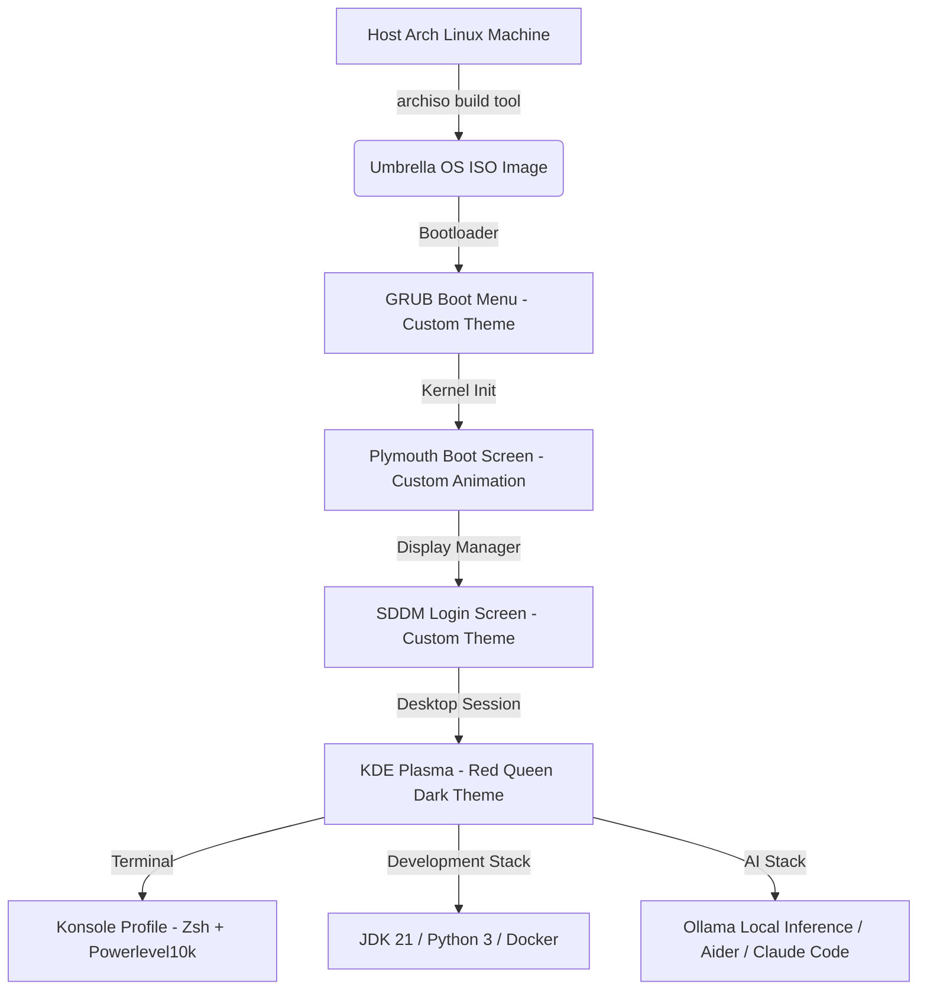

# Project Requirements Document (PRD): Umbrella OS

| Property | Details |
| --- | --- |
| **Project Name** | Umbrella OS |
| **Status** | Requirements Defined (Draft) |
| **Target Version** | 1.0.0-ACADEMIC |
| **Base Platform** | Arch Linux (x86_64) |
| **Build System** | Archiso |

---

## 1. Executive Summary & Vision

### 1.1 What We Are Building
**Umbrella OS** is a custom, bootable, Arch-based Linux distribution compiled using the `archiso` build tool. It is engineered to provide a **production-ready, zero-configuration workstation** for Java/Python software developers and AI/ML enthusiasts. 

The system features a deeply customized desktop environment with a theme inspired by the **Umbrella Corporation** (clinical white text, dark backgrounds, and crimson red highlights) simulating the high-tech, commanding aesthetic of the **Red Queen AI** from the *Resident Evil* universe.



### 1.2 Purpose & Core Philosophy
The core philosophy of Umbrella OS is **"Zero Setup, Absolute Styling"**:
- **Zero Setup:** Eliminate the hours software developers waste setting up environments on fresh OS installs by bundling compilers, runtimes, package managers, and editors out-of-the-box.
- **Academic Rigor:** Demonstrate operating system concepts (boot sequencing, skeletal home directories, service configurations, and dependency trees) for evaluation panels.
- **Aesthetic Excellence:** Deliver a dark-themed user interface that is highly responsive, visual, and unique.

---

## 2. Targeted Users & Persona Definitions

Umbrella OS targets three distinct user personas, each with unique needs:

### 2.1 The Java & Python Developer
* **Needs:** Runtimes pre-installed, build systems configured, environment variables set, and an extensible IDE.
* **Pain Point:** Installing JDK/Python, adding system paths, setting up virtual environments, and manually downloading VS Code extensions.
* **Umbrella OS Value:** Pre-bundled JDK 21, Python 3, Maven, Gradle, pip, and VS Code with pre-installed extensions. All paths (`JAVA_HOME`, `PYTHONPATH`) are pre-exported in Zsh.

### 2.2 The AI/ML & LLM Enthusiast
* **Needs:** Local model running capability, offline AI-assisted coding tools, and modern AI/ML package libraries.
* **Pain Point:** Complex orchestration of CUDA/OpenCL, local model downloads, setting up APIs, and configuring terminal interfaces for AI utilities.
* **Umbrella OS Value:** Pre-configured Ollama server service, Aider pair-programming CLI tool pre-pointed to local model endpoints, Claude Code CLI tools, and core Python ML packages (`torch`, `transformers`, `numpy`, `pandas`) pre-installed.

### 2.3 The Academic Evaluation Panel (VIVA Evaluators)
* **Needs:** Demonstrable proof of system-level skills, technical depth, and understanding of OS architecture.
* **Pain Point:** Distinguishing a "reskinned" theme pack from a genuine custom Linux build.
* **Umbrella OS Value:** Fully documented bootstrap pipeline, custom GRUB theme scripts, initramfs hooks for Plymouth, systemd services management, and user skeletal copy mechanisms (`/etc/skel`).

---

## 3. Detailed Features & Requirements

### 3.1 Custom Boot & Identity Experience (Visual Branding)

| ID | Feature | Specification |
| --- | --- | --- |
| **FR-VIS-01** | **Custom GRUB Theme** | Black background, crimson red select highlights, clinical white text, and an explicit warning banner: `"UMBRELLA CORPORATION — AUTHORIZED PERSONNEL ONLY"`. |
| **FR-VIS-02** | **Plymouth Boot Splash** | An animation showing the rotating Umbrella Corp logo alongside a subtle red glowing progress bar during system startup. |
| **FR-VIS-03** | **SDDM Login Theme** | A matching custom login manager interface containing Umbrella branding elements and matching dark-red color palettes. |
| **FR-VIS-04** | **System Wallpapers** | High-definition (1080p and 4K) Umbrella Corp wallpapers placed in `/usr/share/wallpapers/UmbrellaOS/` and applied to the user desktop by default. |

### 3.2 Desktop & Environment Layer (Red Queen Theme)

| ID | Feature | Specification |
| --- | --- | --- |
| **FR-DE-01** | **KDE Plasma Customization** | Lightly application style applied. Custom color scheme: Background `#0A0A0A`, Foreground `#F0F0F0`, selection color `#CC0000`, active titlebar `#1A0000`. |
| **FR-DE-02** | **Red Queen Panel** | Translucent panel (80% opacity) positioned at the bottom containing custom application launcher icon (Umbrella Logo), system tray, window lists, and digital clock. |
| **FR-DE-03** | **Icons & Typography** | `Papirus-Dark` icon sets. Default system font set to `Roboto` and monospaced font configured as `JetBrains Mono`. |
| **FR-DE-04** | **Konsole Terminal Profile** | Profile named `Red Queen` with semi-transparent background, red cursor, `JetBrains Mono` font, and custom `.zshrc` integration. |

### 3.3 Zsh Shell Shell Experience

| ID | Feature | Specification |
| --- | --- | --- |
| **FR-SH-01** | **Oh My Zsh Framework** | Pre-installed for the default user shell, utilizing plugins for `git`, `docker`, `python`, `mvn`, `gradle`, `zsh-syntax-highlighting`, and `zsh-autosuggestions`. |
| **FR-SH-02** | **Powerlevel10k Prompt** | Pre-configured configuration (`.p10k.zsh`) featuring matching crimson colors and clean status indicators. |
| **FR-SH-03** | **Interactive ASCII Banner** | Displays an ASCII representation of the Umbrella Corporation logo along with user access level authorization status and date stamp upon terminal execution. |
| **FR-SH-04** | **Developer Aliases** | Pre-configured aliases for common dev workflows: `cls`, `ll`, `la`, `gs`, `ga`, `gc`, `gp`, `ai` (runs local Ollama models), and `aider`. |

### 3.4 Developer Stack (Out-of-the-Box Tooling)

| ID | Feature | Specification |
| --- | --- | --- |
| **FR-DEV-01** | **Java Environment** | OpenJDK 21 (LTS) along with Maven (`mvn`) and Gradle package tools. |
| **FR-DEV-02** | **Python Environment** | Python 3 interpreter, `pip`, `virtualenv`, and `pipx`. |
| **FR-DEV-03** | **Global Libraries** | Standard libraries pre-installed: `numpy`, `pandas`, `matplotlib`, `scikit-learn`, `torch`, `torchvision`, `transformers`, `requests`, `fastapi`, `rich`. |
| **FR-DEV-04** | **IDE & Editor** | VS Code (open-source binary `code`) pre-configured with Python, Java, Jupyter, GitLens, and material icon theme extensions. |
| **FR-DEV-05** | **Docker Containerization** | Docker Engine and Docker Compose installed; systemd service enabled by default; standard user added to the `docker` group. |
| **FR-DEV-06** | **CLI Tooling** | Utilities included: `git`, `github-cli`, `lazygit`, `tmux`, `fzf`, `ripgrep`, `fd`, `bat`, `eza`, `btop`, `fastfetch`. |

### 3.5 Local & Connected AI Stack

| ID | Feature | Specification |
| --- | --- | --- |
| **FR-AI-01** | **Ollama Service** | Ollama local model runner installed, and `ollama.service` enabled under systemd to host a local server at `127.0.0.1:11434`. |
| **FR-AI-02** | **Aider Integration** | Command-line pair-programming helper pre-configured via `~/.config/aider/.aider.conf.yml` to automatically interface with local Ollama endpoints (e.g. `llama3.2`). |
| **FR-AI-03** | **Claude Code** | Anthropic's official Claude Code utility installed globally via npm. |

### 3.6 Automated User Distribution (`/etc/skel` Mechanism)

| ID | Feature | Specification |
| --- | --- | --- |
| **FR-SKEL-01** | **Config Copying** | All home directory config files must reside inside `/etc/skel` in the ISO filesystem image (`airootfs/etc/skel/`). |
| **FR-SKEL-02** | **Username Portability** | All pathing definitions in configurations must use environment variables (`$HOME`) or relative references to guarantee configuration portability across different users. |

---

## 4. Technical Specifications & File Structure

The project directory will organize custom configuration structures and copy them during the build phase:

```
Umbrella-Corporation_OS/
├── README.md                              # Academic Overview
├── docs/
│   └── prd.md                             # This document (Project Requirements)
├── archiso/                               # Profile files
│   ├── packages.x86_64                    # Declarative package list
│   ├── profiledef.sh                      # Custom ISO permissions & label specs
│   ├── pacman.conf                        # Build repository configurations
│   ├── airootfs/                          # System overlay folder
│   │   ├── etc/
│   │   │   ├── hostname                   # Set to "umbrella-os"
│   │   │   ├── locale.conf                # Default locale (en_US.UTF-8)
│   │   │   ├── default/useradd            # Sets Zsh as default user shell
│   │   │   ├── systemd/system/            # Services setup
│   │   │   └── skel/                      # Default user configuration files
│   │   │       ├── .zshrc
│   │   │       ├── .p10k.zsh
│   │   │       ├── .config/
│   │   │       │   ├── fastfetch/
│   │   │       │   └── Code/User/settings.json
│   │   │       └── .local/share/konsole/
│   │   └── usr/local/bin/
│   │       └── umbrella-post-install.sh   # Post-boot setup script (yay, AUR packages)
│   └── grub/
│       └── grub.cfg                       # Live environment boot loader config
```

---

## 5. Non-Functional Requirements (NFR)

### 5.1 ISO Size Constraint
- **Goal:** The compiled output ISO should be kept under **8 GB** to remain writeable to standard USB flash drives. Runtimes must be bundled, but local LLM models (e.g. Llama 3.2 weight files) must *not* be bundled into the ISO to avoid size inflation.

### 5.2 Performance & Responsiveness
- **Goal:** The Live environment should initialize to the SDDM screen in under **45 seconds** on a modern virtual machine (allocated with 4 vCPUs and 4GB RAM).
- **Audio/Video:** PipeWire must serve audio pipelines efficiently, and the screen should scale automatically under modern VM display clients (virtio-gpu).

### 5.3 Offline Functionality
- **Goal:** All developer tooling (compiling Java, writing Python, Git actions, using system logs) must work completely offline. Local AI tools (Ollama + model execution) must function offline once models are downloaded.

---

## 6. Success Criteria & Verification Matrix

The project is considered fully complete and successful if it satisfies the following validation points:

1. **Successful ISO Compilation:** Running the `mkarchiso` command succeeds without package conflicts or signature verification failures.
2. **Boot Success:** The output ISO boots successfully in both UEFI (via OVMF) and Legacy BIOS configurations.
3. **Theming Verification:** On boot, the user is greeted by the custom Plymouth animation, custom SDDM login interface, and landing wallpaper without manual settings configuration.
4. **Shell Execution:** Opening a terminal launches Zsh with the Oh My Zsh theme, shows the Umbrella welcome ASCII art banner, and correctly executes customized developer aliases.
5. **Toolchain Verification:** `java`, `python3`, `docker`, and `git` commands are globally available and execute without errors in the terminal environment.
6. **Local AI Verification:** Running `ollama` shows the local model runner daemon is active.
