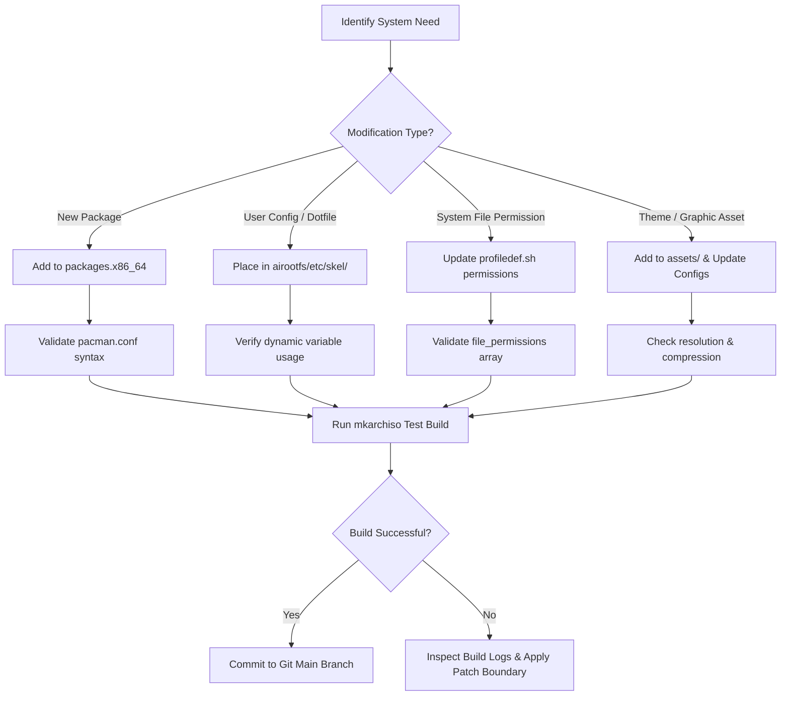
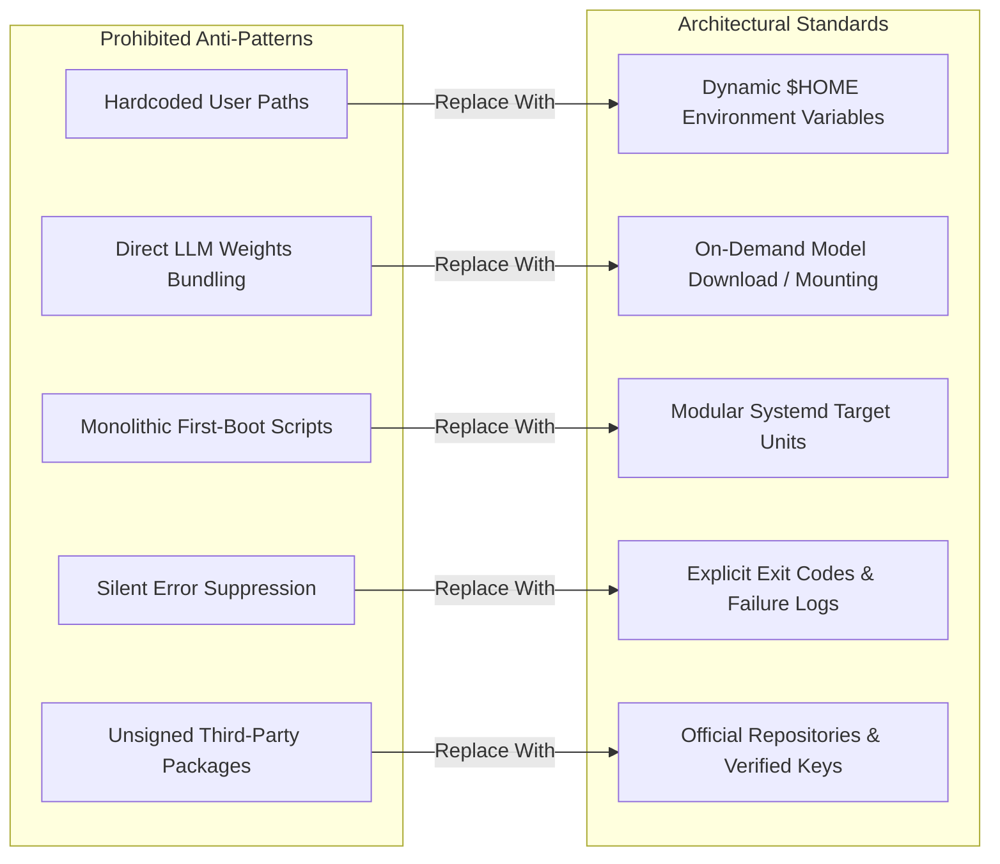
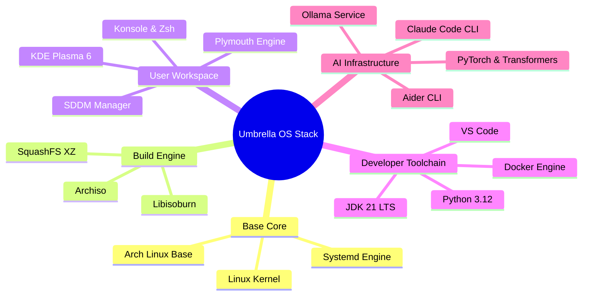
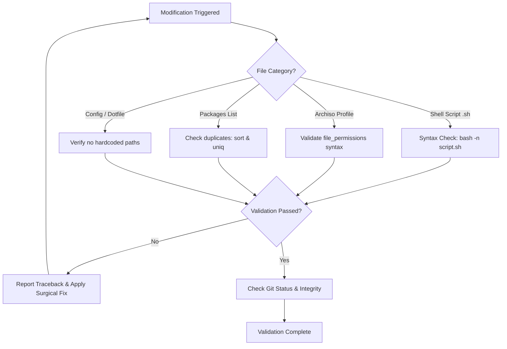

# Development Guidelines, Boundaries & Quality Standards: Umbrella OS

| Document Metadata | Specification |
| --- | --- |
| **System Name** | Umbrella OS |
| **Document Type** | Development Rules, Standards & AI Boundaries |
| **Version** | 1.0.0-ACADEMIC |
| **Scope** | Core OS Developers, System Maintainers, AI Coding Agents |

---

## 1. Core Engineering Principles (What We Use & Do)

To maintain system determinism, stability, and aesthetic integrity across builds, all system modifications must follow these core engineering principles.

### 1.1 Declarative Package & Configuration Management
* **Declarative Manifests:** Package inclusions must be specified in [`archiso/packages.x86_64`](file:///home/aakash/Code/CODE-SOURCE/Umbrella-Corporation_OS/archiso/packages.x86_64). Avoid adding ad-hoc installation steps inside post-install scripts unless the package is unavailable in official repositories.
* **Skeletal Home Provisioning:** User configurations (dotfiles, terminal profiles, editor settings) must reside within `airootfs/etc/skel/`. This ensures every new user account automatically inherits system dotfiles without requiring runtime execution scripts.
* **Explicit Permission Mapping:** File ownership and access permissions must be declared explicitly in [`archiso/profiledef.sh`](file:///home/aakash/Code/CODE-SOURCE/Umbrella-Corporation_OS/archiso/profiledef.sh) under `file_permissions`.

### 1.2 System Service & Runtime Decoupling
* **Isolated Background Daemons:** Runtimes such as Docker Engine (`docker.service`) and local AI inference (`ollama.service`) must run as decoupled systemd services enabled via `airootfs/etc/systemd/system/multi-user.target.wants/`.
* **Dynamic Environment Binding:** Environment variables (`JAVA_HOME`, `PYTHONPATH`, `OLLAMA_HOST`) must be exported dynamically inside `/etc/skel/.zshrc` using `$HOME` references rather than fixed user paths.

### 1.3 Recommended Developer Workflow

---

## 2. Architectural Anti-Patterns (What to Avoid)

Senior systems engineering standards prohibit practices that introduce non-deterministic behavior, build fragility, or security vulnerabilities.

### 2.1 Critical Anti-Patterns Checklist

| Anti-Pattern | Reason for Exclusion | Approved Replacement |
| --- | --- | --- |
| **Hardcoded Home Paths** (`/home/live/` or `/home/user/`) | Breaks user portability when ISO boots under different usernames or installs to disk. | Use `$HOME`, `~`, or relative skeletal paths in `/etc/skel/`. |
| **Direct AI Model Weights Bundling** | Including Multi-GB model weights (e.g. Llama 3.2 8B) inflates ISO size beyond the 8GB limit. | Ship Ollama binary and service daemon; fetch models post-boot or via volume mounts. |
| **Monolithic Setup Scripts** | Single large shell scripts executing all startup setup lead to race conditions and unhandled failures. | Use native systemd service targets and modular scripts with strict error checking (`set -euo pipefail`). |
| **Silent Error Masking (`|| true`)** | Masking non-zero exit codes in build scripts obscures broken package builds and corrupted configs. | Allow explicit script termination, capture error logs, and fix root cause contracts. |
| **Ad-Hoc Modifications Outside Chroot** | Modifying host machine files during ISO build phase corrupts build environment integrity. | Confine all filesystem operations strictly within the `airootfs` directory layout. |

---

## 3. Libraries, Packages & Dependency Boundaries

To maintain a clean academic and production-ready distribution, system dependencies are classified into strict dependency tiers:

### 3.1 Tier Classification Rules

1. **Tier 1: Core System & Bootloader (Immutable Base)**
   - Includes `base`, `linux`, `linux-firmware`, `archiso`, `grub`, `efibootmgr`, `systemd`.
   - *Rule:* Must not be modified or replaced with custom forks without full regression testing.

2. **Tier 2: Desktop & User Experience (Branding Layer)**
   - Includes `plasma-desktop`, `sddm`, `plymouth`, `konsole`, `zsh`, `papirus-icon-theme`.
   - *Rule:* Configured purely via configuration overlays inside `airootfs/etc/skel/` and `airootfs/etc/sddm.conf.d/`.

3. **Tier 3: Software Engineering Runtimes (Developer Layer)**
   - Includes `jdk21-openjdk`, `python`, `python-pip`, `docker`, `docker-compose`, `code`, `git`, `maven`, `gradle`.
   - *Rule:* Installed globally via declarative package manifests; environment variables exported in `/etc/skel/.zshrc`.

4. **Tier 4: Artificial Intelligence Stack (AI Infrastructure Layer)**
   - Includes `ollama`, `aider`, `@anthropic-ai/claude-code`, `python-pytorch`, `python-transformers`.
   - *Rule:* Services enabled via systemd symlinks; configuration defaults stored under `/etc/skel/.config/aider/`.

---

## 4. Error Handling Boundaries & AI Safety Protocols

When human developers or AI agents modify the codebase, strict safety rules enforce validation before declaring any task complete.

### 4.1 AI Agent & Developer Execution Boundaries

1. **Traceback-Driven Diagnosis:**
   - Never guess failure causes. Read the exact stdout/stderr logs from `mkarchiso` or script executions before modifying code.

2. **No Superficial Symptom Patches:**
   - Never suppress errors by adding `2>/dev/null` or `|| exit 0` to broken build commands. Fix the underlying file permission, package name, or configuration key.

3. **Mandatory Runtime & Build Verification:**
   - Editing a file does not complete a task. Shell scripts must be tested using `bash -n`, configuration files validated against schemas, and `profiledef.sh` verified against actual files in `airootfs`.

4. **Surgical File Edits:**
   - Modify only the target lines or blocks required for the feature or fix. Preserve existing docstrings, comments, and licensing headers.

5. **Permission Synchronization:**
   - Whenever an executable script is added to `airootfs/usr/local/bin/` or `airootfs/root/`, it MUST be registered in `archiso/profiledef.sh` under `file_permissions` with mode `0755`.
